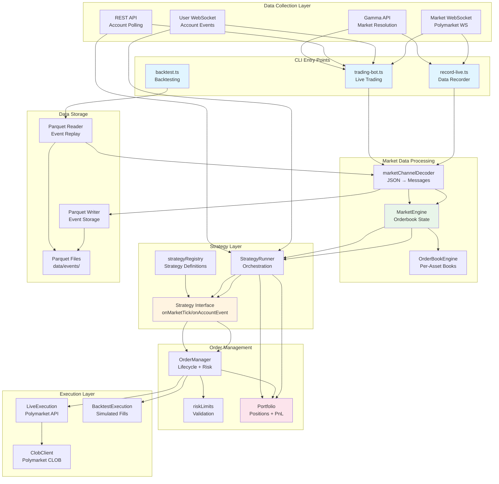
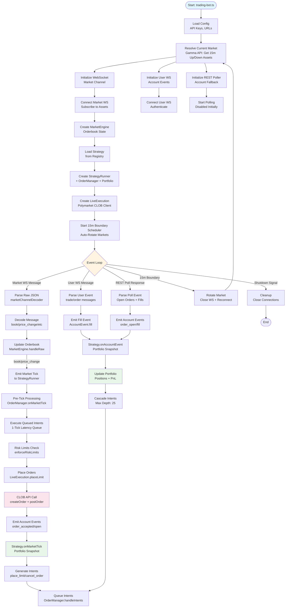
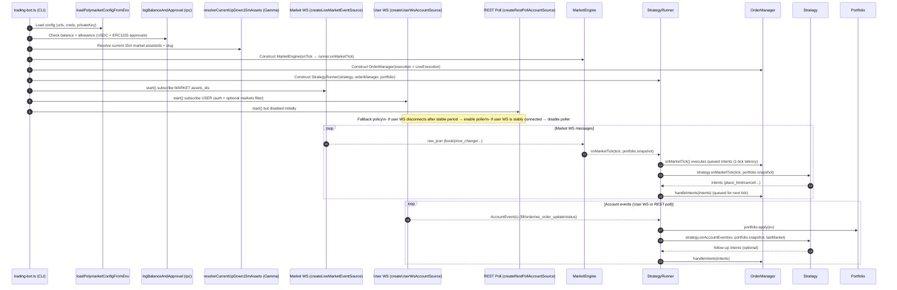
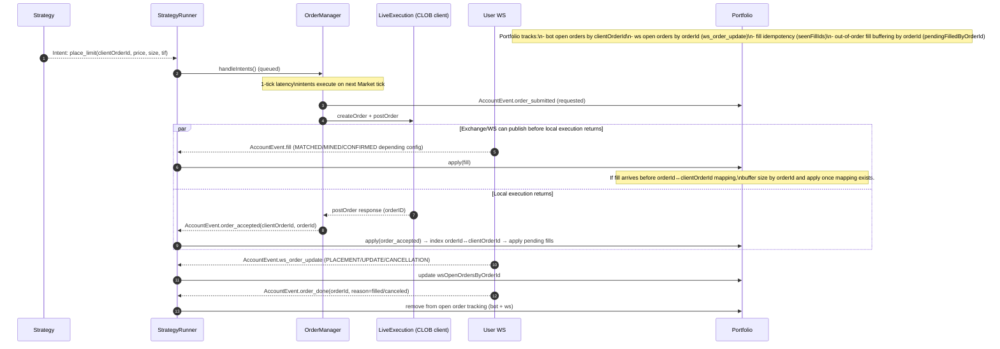
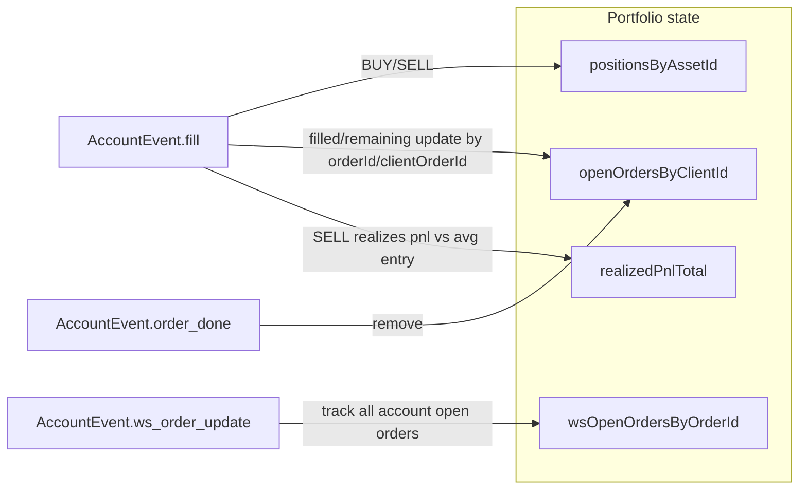
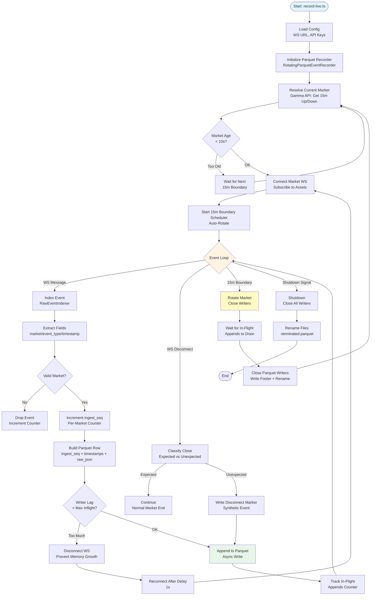

# Polymarket Trading Bot - Architecture Diagrams

## Component Architecture Diagram

## System Flow Diagram - Live Trading

## `trading-bot.ts` Runtime Flow (Focused)

### Startup + steady-state loops (Market WS + Account WS + optional REST poll fallback)

### Order lifecycle + portfolio updates (fast fills + out-of-order handling)

### What updates balances/positions?

## System Flow Diagram - Backtesting

```mermaid
flowchart TD
    Start([Start: backtest.ts]) --> ParseArgs[Parse CLI Args<br/>Parquet Files + Strategy]
    ParseArgs --> LoadStrategy[Load Strategy<br/>from Registry]
    LoadStrategy --> CreateRunner[Create StrategyRunner<br/>+ OrderManager + Portfolio]
    CreateRunner --> CreateBacktestExec[Create BacktestExecution<br/>Simulated Order Matching]

    CreateBacktestExec --> OpenParquet[Open Parquet Files<br/>Multiple Files Supported]
    OpenParquet --> CreateHeap[Create Min-Heap<br/>Merge by ingest_seq]

    CreateHeap --> ReplayLoop{Replay Loop<br/>Tick-by-Tick}

    ReplayLoop -->|Next Event| PopHeap[Pop from Heap<br/>Smallest ingest_seq]
    PopHeap --> ParseRow[Parse Parquet Row<br/>raw_json + timestamps]
    ParseRow --> DecodeMsg[Decode Message<br/>marketChannelDecoder]

    DecodeMsg --> UpdateOrderbook[Update Orderbook<br/>MarketEngine.handleRaw]
    UpdateOrderbook -->|book/price_change| EmitTick[Emit Market Tick<br/>to StrategyRunner]

    EmitTick --> PreTick[Pre-Tick Processing<br/>OrderManager.onMarketTick]
    PreTick --> ExecuteQueued[Execute Queued Intents<br/>1-Tick Latency Queue]
    ExecuteQueued --> RiskCheck[Risk Limits Check<br/>enforceRiskLimits]
    RiskCheck --> SimPlaceOrder[Simulate Order Placement<br/>BacktestExecution.placeLimit]

    SimPlaceOrder -->|FOK| ImmediateFill[Immediate Fill<br/>Match Against Book]
    SimPlaceOrder -->|GTC/GTD| RestOrder[Rest Order<br/>Track in openByClientId]

    ImmediateFill --> EmitFill[Emit Fill Events<br/>AccountEvent.fill]
    RestOrder --> CheckMakerFill[Check Maker Fill<br/>onMarketTick: Touch Cross]
    CheckMakerFill -->|Crossed| EmitFill
    CheckMakerFill -->|Not Crossed| ContinueReplay

    EmitFill --> StrategyTick[Strategy.onMarketTick<br/>Portfolio Snapshot]
    StrategyTick --> GenerateIntents[Generate Intents<br/>place_limit/cancel_order]
    GenerateIntents --> QueueIntents[Queue Intents<br/>OrderManager.handleIntents]

    EmitFill --> UpdatePortfolio[Update Portfolio<br/>Positions + PnL]
    UpdatePortfolio --> CascadeIntents[Cascade Intents<br/>Max Depth: 25]
    CascadeIntents --> QueueIntents

    ReplayLoop -->|File Complete| NextFile{More Files?}
    NextFile -->|Yes| ReplayLoop
    NextFile -->|No| SettleMarket[Settle Market Episode<br/>Merge + Redeem Positions]

    SettleMarket --> ComputeMerge[Compute Merge Opportunities<br/>Paired YES/NO Positions]
    ComputeMerge --> SyntheticMerge[Synthetic Merge Fills<br/>Sell at 1.0 + 0.0]
    SyntheticMerge --> InferWinner[Infer Winner Asset<br/>Best Bid Comparison]
    InferWinner --> SyntheticRedeem[Synthetic Redeem Fills<br/>Winner: 1.0, Loser: 0.0]

    SyntheticRedeem --> UpdatePortfolio
    UpdatePortfolio --> CalculateMetrics[Calculate Metrics<br/>PnL, Win Rate, etc]

    CalculateMetrics --> PrintResults[Print Results<br/>Per-Market + Summary]
    PrintResults --> End([End])

    ContinueReplay --> ReplayLoop

    style Start fill:#e1f5ff
    style ReplayLoop fill:#fff4e1
    style StrategyTick fill:#e8f5e9
    style SimPlaceOrder fill:#fce4ec
    style UpdatePortfolio fill:#e8f5e9
    style SettleMarket fill:#fff9c4
```

## System Flow Diagram - Data Recording

## Key Architectural Principles

### 1. **Shared Core Logic**

- `MarketEngine` and `StrategyRunner` are identical for live trading and backtesting
- Ensures strategy behavior matches exactly between modes
- Orderbook reconstruction uses the same decoder and engine

### 2. **Execution Abstraction**

- `ExecutionAdapter` interface abstracts live vs simulated execution
- `LiveExecution` calls Polymarket CLOB API
- `BacktestExecution` simulates fills against orderbook snapshots
- `OrderManager` works with either adapter transparently

### 3. **Event-Driven Architecture**

- Market ticks trigger strategy evaluation
- Account events (fills, order updates) cascade through strategy
- Portfolio updates are deterministic and event-sourced

### 4. **1-Tick Latency Queue**

- Intents generated on tick N execute on tick N+1
- Prevents feedback loops and ensures deterministic behavior
- Critical for backtest reproducibility

### 5. **Portfolio State Management**

- `Portfolio` tracks positions, orders, and realized PnL
- State updates are deterministic based on account events
- Closed positions are removed to keep state bounded

### 6. **Market Rotation**

- 15-minute windows align with Polymarket's Up/Down markets
- Automatic rotation at window boundaries
- Fresh state for each market episode

### 7. **Data Recording**

- Raw JSON events stored in Parquet format
- Per-market ingestion sequence numbers for ordering
- Synthetic disconnect markers for data gap detection

### 8. **Risk Management**

- `riskLimits` enforces position and order size limits
- Applied before order execution
- Prevents over-leveraging and invalid orders
