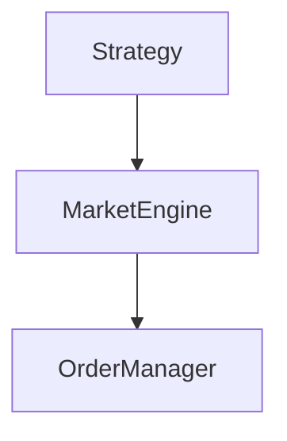

# Build the Documentation Site

This guide explains how to develop, build, and preview the Polymarket Bot documentation site — a [VitePress](https://vitepress.dev/) project located in the `docs-site/` directory.

## Prerequisites

- **Node.js v20** (match the version pinned by the root project)
- `npm` (bundled with Node.js)

## Install Dependencies

Navigate to the `docs-site/` directory and install packages:

```bash
cd docs-site
npm install
```

::: tip
Dependencies are separate from the root project. Always run `npm install` inside `docs-site/` before running any docs commands.
:::

## Start the Development Server

```bash
npm run dev
```

VitePress starts a local server with hot-reload. Open `http://localhost:5173/polymarket-bot/` in your browser. Every change to a Markdown file or `config.ts` is reflected immediately without a full restart.

## Build for Production

```bash
npm run build
```

This compiles all Markdown pages into static HTML and assets under `docs-site/.vitepress/dist/`. The same command runs in CI (`quality.yml`) — a passing build is required before any PR can merge.

::: warning
The build fails on broken internal links. Fix all `[text](/path)` links before pushing.
:::

## Preview the Production Build

```bash
npm run preview
```

Serves the contents of `.vitepress/dist/` locally so you can verify the production output (including the `/polymarket-bot/` base path) before pushing.

## Add a New Page

1. Create a Markdown file inside the appropriate subdirectory:

   ```
   docs-site/other/my-new-page.md
   ```

2. Start the file with frontmatter:

   ```md
   ---
   title: My New Page
   description: One-sentence description for SEO.
   ---

   # My New Page
   ```

3. Register the page in the sidebar inside `.vitepress/config.ts`. Find the section you want to add it to and insert a new entry:

   ```typescript
   {
     text: 'Other',
     items: [
       // ... existing entries ...
       { text: 'My New Page', link: '/other/my-new-page' }, // [!code ++]
     ],
   }
   ```

::: tip Clean URLs
The site uses `cleanUrls: true`. Link paths omit the `.html` extension — use `/other/my-new-page`, not `/other/my-new-page.html`.
:::

## Use Mermaid Diagrams

The site includes [`vitepress-plugin-mermaid`](https://github.com/emersonbottero/vitepress-plugin-mermaid). Add diagrams with a fenced code block:

````md

````

## Project Structure

```
docs-site/
├── .vitepress/
│   └── config.ts          # Site configuration and sidebar
├── other/                 # Most documentation pages live here
├── strategy/              # Strategy-specific pages
├── engine/                # Engine internals pages
├── plugins/               # Plugin pages
├── contribution/          # Developer workflow pages
├── index.md               # Site home page
├── quickstart-new.md
└── package.json
```

## CI Check

The `quality.yml` workflow runs `npm run build` inside `docs-site/` on every PR. A build failure blocks the merge. Run the build locally before opening a PR to catch broken links or invalid Markdown early.
