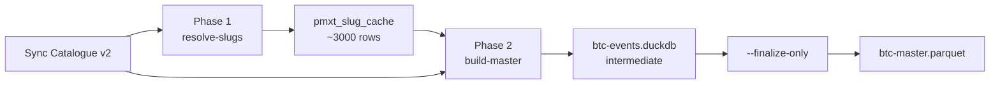

# Build Master v2

This guide takes you from a freshly synced v2 catalogue to a single `btc-master.parquet` that contains **every** event PMXT recorded for every BTC up/down 15-minute market in the v2 range.

::: tip Why a master file?
Unlike v1, an isolated v2 hourly file rarely contains the initial `book` snapshot for both outcome tokens of a market — those broadcasts often happened in a different (earlier) hour. The master parquet sidesteps this by accumulating events for **all markets across the entire archive** into one file, so each market's full event stream — including its initial book — is preserved. See [Overview › Why v2 needs a different pipeline](/datasets/pmxt/overview#why-v2-needs-a-different-pipeline).
:::

## Prerequisites

You must have run [Sync Catalogue](/datasets/pmxt/sync-catalog) with `--version v2` so that `pmxt_dataset_catalogue` is populated with the hourly file list.

## Pipeline overview



## Phase 1 — resolve every BTC slug

The first phase walks every 15-minute window inside the v2 hour range and resolves each `btc-updown-15m-<epoch>` slug to its Polymarket `conditionId` and CLOB `tokenIds` via the Gamma API. Results are cached in `pmxt_slug_cache` so subsequent runs (or Phase 2) never re-hit Gamma for the same slug.

::: code-group

```bash [npm]
npm run pmxt:resolve-slugs:v2
```

```bash [npx with options]
npx tsx src/pmxt/resolve-slugs-v2.ts --symbol btc --delay-ms 300
```

:::

### Options

| Flag | Default | Description |
|---|---|---|
| `--symbol` | `btc` | Symbol to enumerate slugs for. |
| `--delay-ms` | `300` | Delay between Gamma calls, to avoid rate limits. |

### What it does

1. Reads the min/max `hour_ts` from `pmxt_dataset_catalogue` where `version='v2'` to determine the range.
2. Enumerates every 15-minute window inside that range (typically ~3000 windows for a month of v2 archive).
3. For each window, looks up the slug in `pmxt_slug_cache`; if absent, calls Gamma, inserts the row, and continues.

The script is fully idempotent — re-run it as the v2 archive grows to pick up new hours.

### Expected output

```text
v2 range: 2026-04-13T17:00:00.000Z → 2026-05-14T21:00:00.000Z  (748 files)
Total 15-min windows in range: 2992
Already cached for symbol=btc: 0
  [2992/2992]  cached=0  resolved=2992  missing=0

Done.
  cached hits:  0
  resolved:     2992
  missing:      0
  total cache:  2992
```

## Phase 2 — build the master parquet

The second phase walks each pending v2 file, filters its rows to only those markets present in `pmxt_slug_cache`, and inserts them into a persistent DuckDB intermediate. When all hours are ingested, a single `COPY ... TO PARQUET` writes the final master file.

::: code-group

```bash [npm — incremental run]
npm run pmxt:build-master:v2 -- --concurrency 4
```

```bash [npm — test with one file]
npm run pmxt:build-master:v2 -- --limit 1
```

```bash [npm — finalize only]
npm run pmxt:build-master:v2 -- --finalize-only
```

```bash [npm — incremental + finalize]
npm run pmxt:build-master:v2 -- --concurrency 4 --finalize
```

:::

### Options

| Flag | Default | Description |
|---|---|---|
| `--symbol` | `btc` | Symbol to process. |
| `--concurrency` | `1` | Parallel download workers. Inserts are always serialized (single writer). |
| `--limit` | _(all pending)_ | Stop after N hours. Useful for smoke testing. |
| `--retry-failed` | off | Reset `failed` jobs back to `pending` before starting. |
| `--finalize` | off | After ingesting, write the master parquet. |
| `--finalize-only` | off | Skip ingestion; only write the master parquet from existing DuckDB intermediate. |
| `--out` | `data/pmxt-v2-master` | Output directory for `btc-events.duckdb` and `btc-master.parquet`. |
| `--temp` | `temp/` | Directory used for raw downloads before insertion. |

### What it does

For each `pmxt_dataset_catalogue` row where `version='v2'`, `symbol='btc'`, and `status='pending'`:

1. Marks the row as `downloading`, downloads the hourly file into `temp/`.
2. Marks the row as `converting`.
3. Executes a single `INSERT INTO btc_events SELECT … FROM read_parquet(...) WHERE CAST(market AS VARCHAR) IN (<conditionIds>)`, assigning a global monotonic `ingest_seq` via a DuckDB sequence.
4. Deletes the downloaded file.
5. Marks the row as `master_done`.

When `--finalize` (or `--finalize-only`) is set, the script issues:

```sql
COPY (SELECT * FROM btc_events ORDER BY market, timestamp, ingest_seq)
TO 'data/pmxt-v2-master/btc-master.parquet'
(FORMAT PARQUET, COMPRESSION GZIP)
```

The write goes to a `.tmp` file first and is renamed on success, so an interrupted finalize leaves the previous master untouched.

::: tip Crash safety
Because the intermediate is a persistent DuckDB database, you can stop and restart the pipeline at any time. A second run uses `status='pending'` in the catalogue to know which hours still need work, and the DuckDB table already contains everything ingested so far. Hours stuck in `downloading` or `converting` from a previous interrupted run are automatically reset to `pending` on startup — no flags needed.
:::

### Expected output

```text
Loaded 2992 unique conditionIds from pmxt_slug_cache
Starting build-master: 748 pending v2 files  symbol=btc  concurrency=4

[1/748][w0] polymarket_orderbook_2026-04-13T17.parquet  downloading...
[1/748][w0] polymarket_orderbook_2026-04-13T17.parquet  inserting...
[1/748][w0] polymarket_orderbook_2026-04-13T17.parquet  done (+192539 rows, 5.7s)  ETA: 1h 11m
...
Pipeline finished in 1h 14m
  done:        748
  failed:      0
  total:       748

Finalizing master parquet → data/pmxt-v2-master/btc-master.parquet
  events in intermediate: 142_388_201
  master parquet written in 38.2s
```

## Output

### File layout

```
data/pmxt-v2-master/
  btc-events.duckdb       # persistent intermediate (~5 GB)
  btc-master.parquet      # final master parquet (~2-3 GB GZIP)
```

You can safely delete `btc-events.duckdb` after the master parquet is finalized, but keeping it makes incremental updates to the master file possible later.

### Schema

| Column | Type | Notes |
|---|---|---|
| `ingest_seq` | `BIGINT` | Globally monotonic across the master file. Useful for deterministic ordering when timestamps tie at the microsecond. |
| `timestamp_received` | `TIMESTAMP WITH TIME ZONE` | PMXT-side receive time. |
| `timestamp` | `TIMESTAMP WITH TIME ZONE` | Exchange-side event time. |
| `market` | `VARCHAR` | Hex `conditionId` (e.g. `0x019a2e6e…`). Already cast from PMXT's BLOB representation. |
| `event_type` | `VARCHAR` | `book`, `price_change`, `last_trade_price`, or `tick_size_change`. |
| `asset_id` | `VARCHAR` | CLOB token id. |
| `bids`, `asks` | `VARCHAR` | JSON-encoded `[[price, size], …]`. Populated for `book` events. |
| `price`, `size`, `side` | `DECIMAL` / `VARCHAR` | Populated for `price_change` and `last_trade_price`. |
| `best_bid`, `best_ask` | `DECIMAL(9,4)` | Populated for `price_change`. |
| `fee_rate_bps` | `USMALLINT` | Populated for `last_trade_price`. |
| `transaction_hash` | `VARCHAR` | Populated for `last_trade_price`. |
| `old_tick_size`, `new_tick_size` | `DECIMAL(9,4)` | Populated for `tick_size_change`. |

## DB state

`pmxt_dataset_catalogue.status` for v2 rows transitions through:

| Status | Meaning |
|---|---|
| `pending` | Waiting to be ingested into the master. |
| `downloading` | Hourly file is being fetched into `temp/`. |
| `converting` | DuckDB `INSERT` in progress. |
| `master_done` | Rows ingested into the intermediate. |
| `failed` | Error during download or insert; `error` column has the message. |

`pmxt_slug_cache` holds the resolved slug-to-market mapping, keyed by slug. The `(symbol, window_start)` index makes range scans cheap.

## Troubleshooting

::: details A run failed mid-way — what now?
Just re-run `npm run pmxt:build-master:v2`. Hours that completed are already `master_done`; in-flight hours are reset to `pending` on startup; the DuckDB intermediate already has everything that was successfully inserted. Add `--retry-failed` if any hours ended up as `failed`.
:::

::: details Phase 1 hits Gamma rate limits
Increase `--delay-ms` (default `300`). The script is idempotent — cached slugs are skipped, so a re-run with a higher delay just continues from where it stopped.
:::

::: details The master parquet is empty after `--finalize-only`
Verify the intermediate has rows: `duckdb data/pmxt-v2-master/btc-events.duckdb -c "SELECT COUNT(*) FROM btc_events"`. If zero, Phase 2 ingestion never ran successfully — check `pmxt_dataset_catalogue` for the v2 row statuses.
:::

## Related

- [Overview](/datasets/pmxt/overview) — v1 vs v2 archive comparison.
- [Sync Catalogue](/datasets/pmxt/sync-catalog) — populate the file list before running this pipeline.
- [Download & Convert v1](/datasets/pmxt/download-and-convert-v1) — the equivalent (but architecturally different) pipeline for v1.
