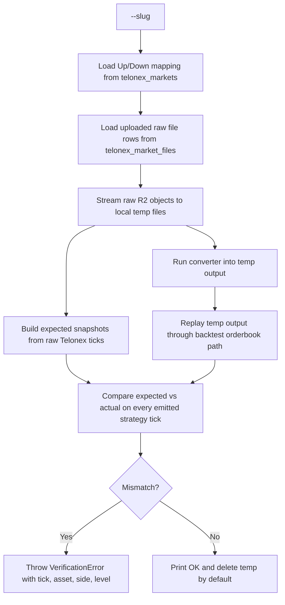
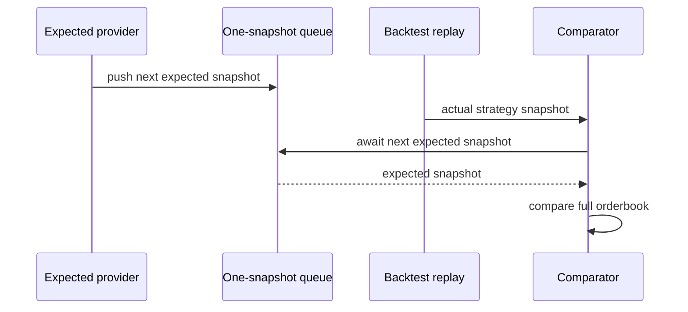

# Verify Telonex Conversions

The `telonex:verify` command is the conversion correctness gate for Telonex data. It does not only check that a Parquet file can be opened. It rebuilds the converted file, replays it through the same orderbook path used by backtests, and compares the reconstructed orderbook against the original raw Telonex snapshots on every emitted strategy tick.

Use this command when you change a converter, add a new converter, change raw parsing, change replay semantics, or need evidence that a converted market is safe to use in backtests.

::: warning Verification scope
Verification proves correctness for the market slug that was run. A passing result for one market does not certify every market in `telonex_markets`. For converter changes, run a representative sample of markets with different row counts, day boundaries, and update densities.
:::

## What This Verifies

The verifier answers one specific question:

> If the backtest engine consumes the converted Telonex file, does it see the same full orderbook state that exists in the original raw Telonex `book_snapshot_full` files at every strategy tick?

For each emitted strategy tick, the verifier compares:

| Field | Comparison |
| --- | --- |
| Market ID | Exact string equality. |
| Strategy tick timestamp | Numeric equality after converting Telonex `timestamp_us` to milliseconds. |
| Asset IDs | Both Up and Down asset books must be present once warm. |
| Bid depth | Same number of bid levels and same level order. |
| Ask depth | Same number of ask levels and same level order. |
| Price | Numeric equality at every level. |
| Size | Numeric equality at every level. |

The comparison is intentionally strict at the orderbook level. A converted file can only pass if the orderbook seen by the strategy runner is the same as the expected orderbook derived from raw Telonex snapshots.

## Command

```bash
npm run telonex:verify -- --slug btc-updown-15m-1764259200
```

By default the verifier runs both converters:

```bash
npm run telonex:verify -- \
  --slug btc-updown-15m-1764259200 \
  --converter both \
  --book-interval 500
```

### Flags

| Flag | Default | Description |
| --- | --- | --- |
| `--slug <slug>` | Required | Market slug from `telonex_markets`. Only one slug is verified per run. |
| `--converter <paired\|delta\|both>` | `both` | Which converter output to build and verify. |
| `--book-interval <N>` | `500` | Delta converter checkpoint interval. Must match the interval you want to certify. |
| `--keep-temp` | `false` | Keep the temporary directory and generated Parquet files after the run. Useful for debugging mismatches. |

::: tip
The verifier always writes converted files to a temporary local directory. It never uploads verifier outputs to R2.
:::

## Batch Verification

Use the batch wrapper when you want to verify many slugs from `telonex_markets`:

```bash
npm run telonex:verify-batch -- --limit 20 --random
```

The batch command does not contain its own comparison logic. It selects slugs from:

```sql
SELECT slug
FROM telonex_markets
WHERE upload_status = 'done'
ORDER BY RAND()
LIMIT 20;
```

Then it runs the single-slug verifier for each selected slug:

```bash
npm run telonex:verify -- \
  --slug <slug> \
  --converter both \
  --book-interval 500
```

### Batch flags

| Flag | Default | Description |
| --- | --- | --- |
| `--limit <N>` | `20` | Number of `upload_status='done'` markets to verify. |
| `--random` | `false` | Randomize selected slugs with `ORDER BY RAND()`. Without it, slugs are selected in slug order. |
| `--converter <paired\|delta\|both>` | `both` | Passed through to each single-slug verifier run. |
| `--book-interval <N>` | `500` | Passed through to each single-slug verifier run. |
| `--continue-on-error` | `false` | Continue after a failed slug and print all failures at the end. By default, batch verification stops at the first failed slug. |

::: warning
The single-slug verifier remains the source of truth. Keep batch verification as orchestration only. Do not duplicate comparison logic in the batch wrapper.
:::

## Prerequisites

Before running verification, the market must already be synced and downloaded:

1. `telonex_markets` contains a row for the slug.
2. `telonex_market_files` contains uploaded raw file rows for that slug.
3. The raw files referenced by `telonex_market_files.r2_key` exist in R2.
4. R2 environment variables are configured: `R2_ENDPOINT`, `R2_BUCKET`, `R2_ACCESS_KEY_ID`, and `R2_SECRET_ACCESS_KEY`.

The verifier does not require an existing converted file. It rebuilds the conversion into temp files so the result always reflects the current converter code.

## High-Level Flow



There are two independent flows after download:

- The **expected** flow reads the original Telonex snapshots and computes what the orderbook should be.
- The **actual** flow reads the converted Parquet exactly as the backtest engine would read it and observes what the `MarketEngine` actually reconstructs.

The converted file is not trusted. It has to prove itself through the replay path.

## Database Discovery

The command intentionally accepts only `--slug`, not raw file paths or asset IDs. This keeps verification aligned with production conversion.

First, it reads `telonex_markets`:

```sql
SELECT slug, outcome_0, outcome_1, asset_id_0, asset_id_1
FROM telonex_markets
WHERE slug = ?;
```

The verifier derives the Up and Down asset IDs from the outcome labels. This matters because code must not assume `asset_id_0` is always Up.

Then it reads uploaded raw files:

```sql
SELECT asset_id, r2_key
FROM telonex_market_files
WHERE slug = ?
  AND status = 'uploaded';
```

Each raw file is tagged as `up` or `down` by matching `asset_id` against the mapping from `telonex_markets`.

::: warning
If a raw file asset ID is not the Up or Down asset for the slug, verification fails immediately. The verifier never guesses side from filename.
:::

## Temporary Files

For each run, the verifier creates a temp directory:

```text
<os.tmpdir()>/telonex-verify-<slug>-<random>/
```

Inside it:

```text
raw/
  <asset_id>_<date>_book_snapshot_full.parquet
paired.parquet
delta.parquet
```

Raw R2 objects are streamed to disk with `getObjectToFile()`. This avoids loading multi-megabyte nested Parquet files into the JavaScript heap. By default, the directory is removed in `finally`. Pass `--keep-temp` to inspect generated files after a failure.

## Raw Tick Reading

Raw Telonex files are read through `streamSortedTickGroupsFromInputs()` in `src/telonex/converters/parsing.ts`.

This helper uses DuckDB to read the raw Parquet files:

```sql
SELECT
  timestamp_us,
  local_timestamp_us,
  market_id,
  slug,
  asset_id,
  bids,
  asks,
  '<filePath>' AS __file_path,
  '<side>' AS __side,
  <fileIdx> AS __file_idx
FROM read_parquet('<filePath>')
ORDER BY timestamp_us, local_timestamp_us, asset_id, __side, __file_idx;
```

DuckDB is used here because the raw Telonex files contain deeply nested bid and ask lists. The JavaScript `parquetjs` cursor was not reliable for large raw files because it could exhaust the default Node heap while decoding nested pages. DuckDB keeps the heavy Parquet scan outside those JavaScript allocations and returns rows in chunks.

Each row is parsed into a `ParsedTick`:

```typescript
type ParsedTick = {
  tsUs: bigint
  localTsUs: bigint
  marketId: string
  slug: string | null
  assetId: string
  bids: { price: string; size: string }[]
  asks: { price: string; size: string }[]
  side: 'up' | 'down'
  filePath: string
}
```

The parser normalizes book side ordering:

- bids are sorted from highest price to lowest price;
- asks are sorted from lowest price to highest price.

Malformed level arrays are dropped rather than silently becoming empty books. A dropped raw row prevents certification because the final stats show `dropped > 0`.

## Expected Snapshot Stream

The verifier builds expected snapshots from the original raw ticks. It does not store all expected snapshots in memory. Instead, it uses a one-item queue between the expected stream and the actual replay stream:



This design is deliberate. Some markets contain hundreds of thousands of raw rows. The verifier only needs the current expected snapshot and the carried orderbook state, so retaining every expected snapshot would add memory pressure without improving correctness.

## Paired Verification Semantics

The paired converter emits `orderbook_pair` rows. Each row contains both Up and Down books in typed columns. Backtests consume it with `--input-mode telonex-paired-parquet`, which applies both books to `MarketEngine` and emits one strategy tick after the pair is applied.

The expected paired provider mirrors that behavior exactly:

1. Raw ticks are grouped by `timestamp_us`.
2. Within the timestamp group, Up ticks and Down ticks are separated and sorted.
3. The verifier computes `n = max(upTicks.length, downTicks.length)`.
4. For each `group_index` from `0` to `n - 1`:
   - use the Up tick at that index if present;
   - otherwise carry forward the last known Up tick;
   - use the Down tick at that index if present;
   - otherwise carry forward the last known Down tick;
   - if either side is not warm yet, skip the frame;
   - otherwise emit one expected strategy snapshot containing both asset books.

This matches the paired converter's carry-forward behavior. The verifier therefore checks the current behavior exactly rather than applying a different theoretical pairing model.

::: warning Carry-forward is part of paired correctness
A paired tick can contain one fresh side and one carried side. That is valid for the paired format. The verifier expects the backtest-visible orderbook to match that carried-forward state exactly.
:::

## Delta Verification Semantics

The delta converter emits live-style `raw_market_event` rows:

- `book` rows are full book checkpoints for one asset;
- `price_change` rows contain one or more level changes;
- Up and Down changes at the same exchange timestamp can be combined into one `price_change` event.

The expected delta provider mirrors the converter's behavior:

1. Raw ticks are grouped by `timestamp_us`.
2. For each asset, the verifier tracks:
   - previous bid levels;
   - previous ask levels;
   - ticks since the last full `book` checkpoint.
3. If an asset has no previous state, or `ticksSinceBook >= --book-interval`, the converter emits a full `book` event.
4. Otherwise, the verifier checks whether the raw tick changes any price level:
   - changed size at an existing price;
   - new price level;
   - removed price level.
5. If there are changes, the expected book for that asset is updated and one expected strategy snapshot is emitted for the resulting `price_change`.
6. If there are no changes, no converted event is expected and no strategy tick is expected.

This means delta verification does not require one output tick for every raw snapshot. It requires every emitted delta strategy tick to reconstruct the same full book state as the source raw tick after applying the delta.

::: tip
It is valid for delta conversion to omit unchanged raw snapshots. Those snapshots do not create strategy ticks, because the backtest engine only sees emitted `book` and `price_change` events.
:::

## Actual Replay Path

The verifier deliberately uses the same replay primitives as backtest:

| Converter | Replay function | Why |
| --- | --- | --- |
| `paired` | `replayTelonexPairedParquetForMarket()` | Paired files are a special typed schema and need the paired replay adapter. |
| `delta` | `replayOrderBookForMarket()` | Delta files use the normal live-recorded schema and should follow the standard backtest path. |

`replayOrderBookForMarket()` was extracted from the backtest CLI into `src/parquet/replay/replayOrderBookForMarket.ts` so verification can use the same behavior without importing the entire CLI.

This preserves the repository invariant: live trading and backtests must run the same strategy logic on the same tick stream semantics.

## Comparison Details

For each actual strategy snapshot, the verifier requests the next expected snapshot and compares them immediately.

At market level:

- `snapshot.market` must equal the expected market;
- `snapshot.timestamp` must equal the expected exchange timestamp in milliseconds.

For every expected asset book:

- the asset book must exist in `snapshot.byAssetId`;
- `market`, `assetId`, and `timestamp` must match;
- bids length must match;
- asks length must match;
- each bid level must match by index;
- each ask level must match by index;
- price and size use numeric equality.

The diagnostic error includes enough context to reproduce the issue:

```text
[telonex:verify:delta] tick=1234 delta price_change ts_us=... group_index=0 asset=...
asks[7] mismatch expected=price=0.57 size=120 numeric=(0.57, 120)
actual=price=0.57 size=119 numeric=(0.57, 119)
```

## Successful Output

Example:

```text
[telonex:verify] slug=btc-updown-15m-1764259200 converter=both book_interval=500 bucket=polymarket-telonex
[telonex:verify] tmp=/var/folders/.../telonex-verify-btc-updown-15m-1764259200-kJHScH
[telonex:verify] mapping up=1104638377... down=1101589125...
[telonex:verify] paired OK raw_ticks=345412 dropped=0 output_rows=172706 strategy_ticks=172706
[telonex:verify] delta OK raw_ticks=345412 dropped=0 output_rows=85540 strategy_ticks=85540 book_interval=500
[telonex:verify] OK
```

Interpretation:

- `raw_ticks` is the number of raw Telonex snapshots parsed across the Up and Down raw files.
- `dropped` is the number of malformed raw rows. A value above zero should be treated as not certified.
- `output_rows` is the number of rows written into the temp converted Parquet.
- `strategy_ticks` is the number of snapshots emitted by replay and compared.

If `dropped` is greater than zero, verification fails and the market is not certified. A dropped raw row means the parser did not understand part of the source Telonex file, so the converter cannot claim 100% source fidelity.

For paired, `output_rows` and `strategy_ticks` should normally be equal because every paired row emits one strategy tick.

For delta, `output_rows` and `strategy_ticks` should also match for the current replay semantics because every emitted `book` or `price_change` row creates a strategy tick. The count can be much lower than `raw_ticks` because unchanged snapshots are intentionally omitted.

## Failure Modes

### Missing slug

```text
[telonex:verify] no telonex_markets row for slug=...
```

Run `telonex:sync` first, or check that the slug is correct.

### Missing uploaded raw files

```text
[telonex:verify] no uploaded raw files for slug=...
```

Run `telonex:download` for the market and confirm `telonex_market_files.status='uploaded'`.

### Cannot derive Up/Down

```text
[telonex:verify] cannot derive Up/Down asset ids for slug=...
```

The `telonex_markets` row must have outcome labels that normalize to `up` and `down`.

### Extra actual tick

```text
[telonex:verify:paired] unexpected extra tick=...
```

The converted file emitted a strategy tick that the raw Telonex expected stream did not predict. This usually means converter grouping or delta omission logic diverged from the expected provider.

### Replay ended too early

```text
[telonex:verify:delta] replay ended before all expected ticks were emitted actual=...
```

The raw expected stream predicted more strategy ticks than replay produced. This usually means the converter dropped a meaningful book change or failed to emit a required checkpoint.

### Level mismatch

```text
bids[12] mismatch expected=... actual=...
```

The converted file replays but reconstructs the wrong book state. This is a conversion correctness failure.

## Extending Verification for a New Converter

When adding a new converter, do not only write schema validation. Add a verifier path with the same structure:

1. Use `--slug` and DB discovery, not manual asset IDs.
2. Download raw files into temp storage.
3. Build expected snapshots from raw Telonex ticks.
4. Run the converter into a temp output file.
5. Replay the output through the same path backtests will use.
6. Compare `MarketEngine` snapshots on every emitted strategy tick.
7. Stop at the first mismatch with canonical diagnostics.

The expected provider must match the converter's tick semantics. For example, if a future converter batches multiple raw updates into one output row, the provider must predict the exact strategy snapshots that backtest replay will emit from that batching model.

::: danger
Do not certify a converter by comparing only row counts, timestamps, or top-of-book values. Strategies can depend on deeper levels. A converter is only correct when the full orderbook state seen by backtest matches the original source state at every emitted strategy tick.
:::

## Relationship to Diagnostics

The legacy tools on [Diagnostics](/datasets/telonex/diagnostics) answer different questions:

- `merge-by-timestamp` inspects whether raw Up and Down files align cleanly by timestamp.
- `omitted-events` compares a live recording against Telonex raw data.
- `telonex:verify` proves that a converter's output reconstructs the intended Telonex raw orderbook state in the backtest engine.

Use diagnostics to understand data coverage. Use verify to certify converter correctness.

## Related Files

| File | Role |
| --- | --- |
| `src/telonex/verify-conversion.ts` | CLI and comparison logic. |
| `src/telonex/verify-conversion-batch.ts` | Batch wrapper that runs the single-slug verifier for multiple database slugs. |
| `src/telonex/converters/parsing.ts` | Raw Telonex parsing and sorted tick grouping. |
| `src/telonex/converters/paired.ts` | Paired converter implementation. |
| `src/telonex/converters/delta.ts` | Delta converter implementation. |
| `src/parquet/replay/replayTelonexPairedParquetForMarket.ts` | Backtest replay adapter for paired files. |
| `src/parquet/replay/replayOrderBookForMarket.ts` | Shared live-format replay path used by backtest and verifier. |

## Next Steps

- [Convert](/datasets/telonex/convert) — produce paired or delta files.
- [Run a Backtest](/datasets/telonex/backtest) — replay converted files in a strategy run.
- [Telonex Verification ADR](/adr/telonex-verification-replay-parity) — read the architectural decision behind tick-by-tick replay verification.
