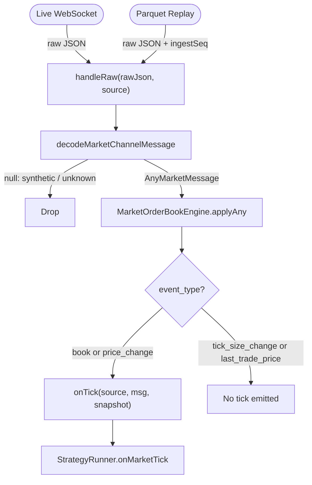

# Market Engine

The `MarketEngine` is the shared entry point through which every WebSocket message passes, whether it originates from a live Polymarket connection or from a Parquet replay. Its design guarantees that the strategy layer sees an identical sequence of events regardless of the data source, which is the foundation of the bot's deterministic backtest invariant.

## Responsibilities

The engine does three things and nothing else:

1. **Decode** a raw JSON string into a typed `AnyMarketMessage`.
2. **Apply** the decoded message to the `MarketOrderBookEngine`, updating in-memory orderbook state.
3. **Emit a tick** to the registered `onTick` callback — but only for `book` and `price_change` events.

This narrow scope is intentional. The engine has no knowledge of strategies, positions, or execution; it is purely a stateful message processor.

## Message Decoding

`decodeMarketChannelMessage` (`src/market/marketChannelDecoder.ts`) is the first gatekeeper. It performs a lightweight JSON parse and checks `event_type` against the known set of real Polymarket market-channel events:

- `book` — full orderbook snapshot
- `price_change` — delta update to one or more price levels
- `tick_size_change` — tick size change for a token
- `last_trade_price` — most recent trade (does not mutate the book directly)

Any message whose `event_type` is not in this set is dropped. This includes the three **synthetic event types** that the recorder injects into Parquet files:

| Synthetic type          | Purpose                                              |
| ----------------------- | ---------------------------------------------------- |
| `disconnect`            | Marks a WebSocket disconnection gap in the recording |
| `window_end`            | Marks the end of a 15-minute market window           |
| `writer_lag_disconnect` | Marks a forced disconnect due to writer backpressure |

::: tip
Synthetic events are recorded in Parquet so that the replay engine can detect and report data gaps. Because `decodeMarketChannelMessage` returns `null` for them, they never reach the orderbook or strategy layer.
:::

The decoder intentionally does **not** validate every field. Numeric strings (e.g., prices, sizes) are left as strings and parsed later by the orderbook engine at the point of consumption. This avoids double-parsing overhead and keeps the decoder fast.

## The `ingest_seq` Role

In live mode, each message arrives over a WebSocket and is processed immediately. In backtest (Parquet replay) mode, the `EngineSource` carries a `filePath` and `ingestSeq` value:

```typescript
export type EngineSource =
  | { kind: 'live'; attempt: number }
  | { kind: 'parquet'; filePath: string; ingestSeq: bigint }
```

The `ingestSeq` is a per-market monotonic integer assigned at record time (see [Parquet Event Schema](./parquet-event-schema.md)). When replaying multiple Parquet files for multi-asset markets, the replay layer heap-merges files by `ingest_seq` to reconstruct the exact original interleaving of events. This is what makes backtest results deterministic and reproducible.

## Tick Emission: Why Only `book` and `price_change`?

After applying the decoded message to the orderbook, `handleRaw` checks the event type before calling `onTick`:

```typescript
if (msg.event_type === 'book' || msg.event_type === 'price_change') {
  await this.onTick?.({ source: args.source, msg, snapshot: this.ob.snapshot() })
}
```

`tick_size_change` and `last_trade_price` update internal state but do not trigger a strategy tick. The reasoning:

- `last_trade_price` does not change the resting orderbook. Subsequent `book` or `price_change` messages will reflect the trade's impact. Emitting a tick on trade notifications alone would give strategies a stale book.
- `tick_size_change` is a metadata update that strategies rarely need to react to immediately. It is always followed by a `book` or `price_change` when the book actually changes.

This filter reduces tick frequency and ensures that every tick the strategy receives carries an orderbook state that has actually changed in a meaningful way.

## Live vs. Backtest: Identical Code Path



The `MarketEngine` constructor accepts optional `expectedAssetIds`, which enables warm-state detection in the underlying `MarketOrderBookEngine`. When provided, the engine tracks whether both YES and NO token books have received their initial `book` snapshot. Strategies can gate order placement on this warmup state.

## Reset on Market Rotation

When the 15-minute market window expires and a new market window opens, the trading bot calls `engine.reset()`. This discards all orderbook state and creates a fresh `MarketOrderBookEngine`, ensuring that stale price levels from the previous window cannot contaminate the new episode.

```typescript
reset(): void {
  this.ob = new MarketOrderBookEngine({
    ...(this.expectedAssetIds ? { expectedAssetIds: this.expectedAssetIds } : {}),
  })
}
```

This reset is also reflected in the `StrategyRunner`, which clears plugin state and invalidates cached plugin snapshots whenever the market key changes.
