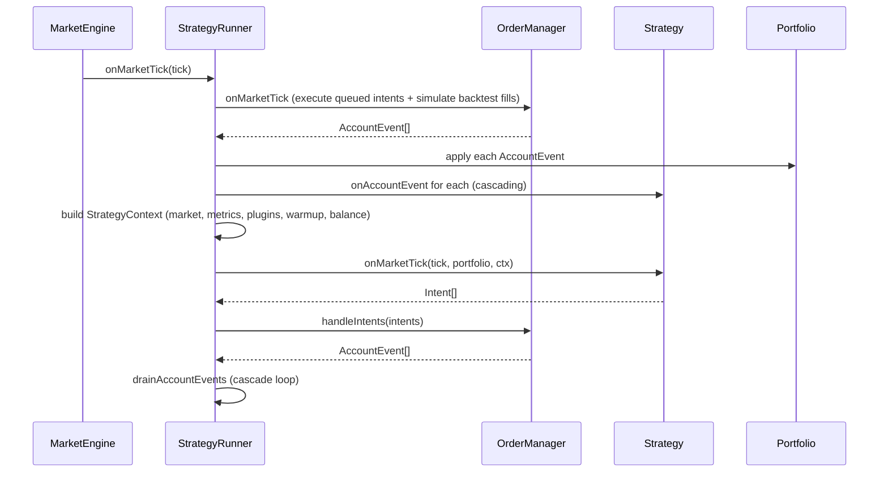

# Strategy Runner

The `StrategyRunner` is the coordination layer between the market engine and the strategy. It mediates every interaction between incoming market data, account state changes, and the strategy's decision-making hooks. Understanding the runner's execution model is essential for writing strategies that behave consistently in both live and backtest modes.

## Tick-Scoped Execution Model

The runner processes market data one tick at a time. A tick corresponds to a single `book` or `price_change` event that the `MarketEngine` has already applied to the orderbook. Within a single call to `onMarketTick`, the runner performs the following sequence:



The `drainAccountEvents` loop at the end is what enables reactive strategies: when a fill event arrives, the strategy's `onAccountEvent` can return new intents (e.g., place a sell order after a buy fills), which in turn may produce more fills, and so on. The loop continues until the queue is empty or the `maxEventsPerDrain` ceiling (default 100) is reached.

## Plugin Snapshot Caching

Plugins are per-tick computations — volatility windows, technical indicators, external price feeds — whose results are exposed to the strategy via `ctx.plugins`. Because `onAccountEvent` can cascade multiple times within a single market tick, the runner caches the plugin snapshot taken at the start of the tick and reuses it for all cascaded `onAccountEvent` calls:

```typescript
const plugins = this.pluginSet ? this.pluginSet.snapshot() : undefined
if (plugins) this.cachedPlugins = plugins
```

When `processAccountEvent` later calls `onAccountEvent`, it uses:

```typescript
const plugins = this.cachedPlugins ?? this.pluginSet?.snapshot()
```

This means plugins are evaluated once per market tick, not once per account event. The rationale is correctness: the market has not moved between cascaded account events within the same tick, so re-evaluating plugins would produce the same result and waste CPU.

::: tip
Plugin snapshots are only refreshed when a new market tick arrives. If a strategy reacts to many fills in a single tick, all those reactions see the same plugin state — the state that was current when the tick began.
:::

## Intent Execution Modes

The runner supports two intent execution modes, controlled by `intentExecutionMode`:

| Mode        | Behavior                                                                                                                                                       |
| ----------- | -------------------------------------------------------------------------------------------------------------------------------------------------------------- |
| `queued`    | Intents emitted on tick N are enqueued and executed at the start of tick N+1. This is the default and models a one-tick round-trip latency. Used in backtests. |
| `immediate` | Intents are executed synchronously within the same tick. Used in live trading for lower effective latency.                                                     |

In `queued` mode, `OrderManager.handleIntents` simply pushes the intents onto a pending list and returns no events. These are then flushed at the top of the next `onMarketTick` call before the new market data is applied to the strategy.

## Account Event Cascading

The cascade mechanism prevents infinite feedback loops via two safeguards:

1. The `draining` boolean prevents re-entrant drain calls. If `drainAccountEvents` is already running (which cannot happen in single-threaded JS, but is a defensive guard), a nested call is a no-op.
2. `maxEventsPerDrain` (default 100) caps the total number of account events processed in one drain cycle. If the limit is exceeded, the remaining queue is dropped and a warning is logged.

The runner also maintains a `recentDrainEvents` ring buffer of the last 10 processed events, which is included in the warning log when the cap is hit to aid debugging.

## Market Key and Episode Boundaries

The runner tracks the current market via `lastMarketKey` (the condition market ID from the snapshot). When the market key changes — which happens on 15-minute window rotation — the runner performs episode-boundary cleanup:

```typescript
if (marketKey && this.lastMarketKey && marketKey !== this.lastMarketKey) {
  this.pluginSet?.reset()
  this.cachedPlugins = undefined
  this.waitedTechIndicatorsMarketKey = null
  this.lateStartCheckedMarketKey = null
  this.lateStartBlockedMarketKey = null
}
```

This ensures that plugin state accumulated during the previous market window does not bleed into the new episode.

## Late-Start Gate

Live bots that start mid-window may encounter markets that have already been open for several minutes. The `skipLateStartAfterMs` option (passed from `trading-bot.ts`) causes the runner to skip strategy execution for any market where the first tick arrives more than the configured threshold after market open. This prevents strategies from entering positions in markets with very little remaining time.

## Technical Indicator Warmup (Backtest)

When `BACKTEST_WAIT_FOR_TECHNICAL_INDICATORS=1` is set, the runner polls the plugin snapshot after the first tick of each episode until the `technicalIndicators` field is populated or a timeout is reached (default 3000 ms, configurable via `BACKTEST_TECH_IND_TIMEOUT_MS`). This prevents the strategy from executing on the first few ticks of an episode before the TA plugin has computed its initial values.

## StrategyContext Construction

On each tick, the runner assembles a `StrategyContext` object and passes it to both strategy hooks. The context is built from whatever providers are available:

```typescript
const ctx: StrategyContext = {
  plugins, // from pluginSet.snapshot()
  market, // from getMarket()
  metrics, // position metrics + orderbook metrics
  balance, // from getBalance() — live only
  warmup, // from getWarmup() — live only
}
```

Fields are omitted when the corresponding provider is not registered (e.g., `warmup` is absent in backtests because there is no warm-state concept for pre-recorded data). Strategies should treat all context fields as optional.
