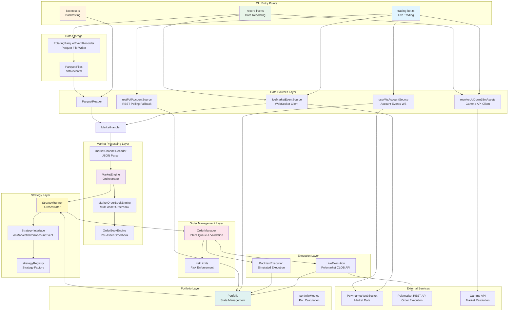
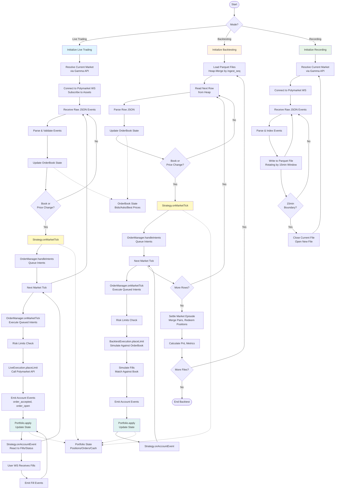

# Polymarket Trading Bot Architecture

## System Architecture Diagram

## System Flow Diagram

## Architecture Overview

### Main Components

**1. CLI Entry Points**
- `trading-bot.ts`: Live trading bot that connects to Polymarket and executes strategies
- `backtest.ts`: Backtesting engine that replays recorded market data
- `record-live.ts`: Data recording tool that captures live market events to Parquet files

**2. Data Sources Layer**
- **Live Sources**: WebSocket connections to Polymarket for market data and account events
- **Replay Sources**: Parquet file readers for backtesting historical data
- **Market Resolution**: Gamma API integration to resolve current 15-minute Up/Down markets

**3. Market Processing Layer**
- **MarketEngine**: Central orchestrator that processes raw JSON events and maintains orderbook state
- **OrderBook Engines**: Hierarchical orderbook management (market-level → asset-level)
- **Event Handler**: Filters and validates incoming events before processing

**4. Strategy Layer**
- **Strategy Interface**: Defines `onMarketTick()` and `onAccountEvent()` hooks
- **StrategyRunner**: Orchestrates strategy execution, manages cascading events
- **Strategy Registry**: Factory pattern for creating strategy instances

**5. Order Management Layer**
- **OrderManager**: Queues intents, validates orders, enforces risk limits
- **Risk Limits**: Prevents over-leveraging and invalid order submissions

**6. Execution Layer**
- **LiveExecution**: Interfaces with Polymarket CLOB API for real trading
- **BacktestExecution**: Simulates order execution against historical orderbook state

**7. Portfolio Layer**
- **Portfolio**: Maintains positions, open orders, fills, and realized PnL
- **Portfolio Metrics**: Calculates merge opportunities and PnL metrics

**8. Data Storage**
- **Parquet Writer**: Rotating file writer that creates one file per 15-minute market episode
- **Parquet Files**: Persistent storage in `data/events/{symbol}/` directory

### Key Design Principles

1. **Shared Logic**: Both live trading and backtesting use the same `MarketEngine`, `StrategyRunner`, `OrderManager`, and `Portfolio` components
2. **Tick-by-Tick Accuracy**: Backtesting replays events in exact order (`ingest_seq`) to match live behavior
3. **Event-Driven Architecture**: Strategies react to market ticks and account events through cascading event handlers
4. **15-Minute Market Episodes**: System rotates markets every 15 minutes, aligning with Polymarket's Up/Down market structure
5. **Separation of Concerns**: Clear boundaries between data sources, market processing, strategy logic, and execution

### Data Flow Summary

**Live Trading:**
1. Resolve current market via Gamma API
2. Connect WebSocket and subscribe to assets
3. Receive raw JSON events → parse → update orderbook
4. On book/price_change ticks → strategy evaluates → generates intents
5. OrderManager queues intents → executes on next tick → calls LiveExecution
6. LiveExecution posts orders to Polymarket API
7. Fills arrive via User WebSocket → Portfolio updates → Strategy reacts

**Backtesting:**
1. Load Parquet files → heap-merge by `ingest_seq`
2. Replay events tick-by-tick → update orderbook
3. Strategy evaluates → generates intents
4. BacktestExecution simulates fills against orderbook
5. Portfolio updates → Strategy reacts
6. At market end → settle positions (merge pairs, redeem winners)
7. Calculate PnL metrics across all markets

**Recording:**
1. Resolve current market via Gamma API
2. Connect WebSocket and subscribe
3. Receive events → parse → write to Parquet file
4. Rotate file every 15 minutes at market boundary
5. Handle disconnects with synthetic markers

