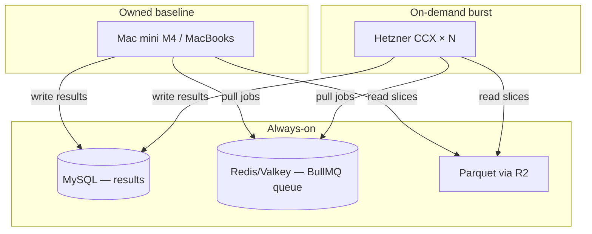

# Cloud Workers & Costs

[Distributed Workers](/backtest/fleet/overview) explains *how* the worker
pool spans multiple machines. This page explains *where* to run those workers
and *what it costs* — the infrastructure and economics behind a distributed
backtest fleet. It is a planning reference: read it before buying hardware,
renting cloud servers, or moving the database off your laptop.

::: tip The one-line conclusion
Own the baseline (Mac minis are the best compute-per-dollar by a wide margin),
keep the database and queue on a single always-on box, and rent cloud only in
**short bursts** — never as a permanent server. Renting a continuous cloud box
to match a machine you could own pays for that machine in ~2–3 months and keeps
billing forever.
:::

## The shape of the system

A distributed fleet has three roles. They have very different hosting needs, so
they should not all live on the same kind of hardware.



- **Coordination + storage** (MySQL, Redis) — RAM- and uptime-bound, almost no
  CPU. Wants one cheap machine that is always on.
- **Baseline compute** (workers) — CPU-bound parquet replay. Best served by
  hardware you own and keep busy.
- **Burst compute** (workers) — occasional large parallel pushes. Best served by
  cloud servers you create and destroy in hours.

## Where the database and queue should live

The backtest data is **reproducible** — every result can be regenerated from the
parquet in R2 plus the strategy code. That weakens the usual argument for managed
durability: losing the MySQL means re-running backtests, not losing irreplaceable
data. So the decision is mostly about uptime and reach, not safety.

| Option | Cost | Latency to workers | Who maintains it |
|---|---|---|---|
| Always-on PC at home (LAN) | $0 | ~0.5 ms | you |
| Hetzner CX23 + volume | ~€5/mo | ~0.5 ms (same DC) | you |
| Managed MySQL + Valkey (DO) | ~$45/mo | ~25 ms | provider |

::: tip Why an underpowered always-on PC is ideal for this role
A coordination/results database is RAM- and uptime-bound, not CPU-bound. Redis is
single-threaded and in-memory; MySQL with plenty of RAM caches the whole dataset
(currently ~1.3 GB) so reads come from memory. A weak-but-always-on box with
32 GB RAM is a better fit than a fast laptop — and it frees your powerful
machines to do replay.
:::

### Latency: what actually matters

- **MySQL is touched per *batch*, not per market.** Workers return results to
  Redis; the aggregator writes the whole run once via `insertBacktestRun`. Moving
  MySQL to a remote host adds only a few hundred milliseconds across an entire
  batch — effectively zero.
- **Redis is touched per *job*.** With a worker pinned to one job at a time, the
  per-job round-trips do not overlap with compute, so remote Redis (~25 ms) can
  add roughly 10–15% to wall time for fast markets. On a LAN this disappears
  entirely; in the cloud it is hidden by giving each worker a little more
  concurrency. See [Parallelization](/backtest/parallelization).

::: details Measured replay profile (73k markets)
Average per-market replay is ~1.5 s, with ~62% of markets in the 1–2 s band and
almost nothing under 0.5 s or over 5 s. This is why the system is CPU-bound and
why Redis latency, not MySQL latency, is the only place remote infrastructure can
bite.
:::

## Comparing machines: parallel throughput

The fleet runs **one single-threaded worker per core**. The right way to compare
machines is therefore **parallel throughput = cores × single-core score**, not
Geekbench multi-core — GB6 multi-core saturates around 16 cores and badly
understates many-core servers for independent jobs.

### Verified single-core (Geekbench 6)

| Hardware | Single-core | Source |
|---|---|---|
| Apple M5 Pro core | ~4,000 (est.) | estimate |
| Apple M4 core | 3,788 | verified |
| Apple M1 Pro core | 2,386 | verified |
| Hetzner CCX (EPYC, dedicated) | ~1,877 | verified |
| DigitalOcean CPU-Optimized Standard (Xeon 8168) | 957 | verified |
| DigitalOcean CPU-Optimized Premium (Xeon 8358) | 1,447 | verified |

::: warning Per-core speed is the trap
A DigitalOcean vCPU is a hyperthread — about **half** the speed of a Hetzner
dedicated core, and roughly a quarter of an Apple M4 core. Two machines with the
same core count are not equivalent. Always weight by single-core speed.
:::

### Devices (from `dashboard/src/data/machines.json`)

Apple device throughput is a **P/E-weighted estimate** (efficiency cores are
slower than performance cores); the multi-core Geekbench figures are verified.

| Device | Cores | GB6 multi (verified) | Parallel throughput (est.) |
|---|---|---|---|
| M5 Pro | 18 | 28,111 | ~68,000 |
| Mac mini M4 | 10 | 14,724 | ~26,500 |
| M1 Pro | 10 | 12,359 | ~21,200 |

## Buy vs rent

A single Hetzner CCX43 (16 dedicated cores) lands in the same compute range as a
Mac mini M4 — by Geekbench multi-core the M4 is actually ahead. But the price
models could not be more different:

| | CCX43 (rent) | Mac mini M4 (own) |
|---|---|---|
| Compute | ~30,000 (cores × single) | ~26,500 |
| Price | **€276 / month, forever** | **~$700 once** |
| Break-even | — | ~2.4 months of continuous use |
| After break-even | still billing | free (minus power) |

::: danger Do not rent continuous cloud to replace owned hardware
At real prices a continuous CCX43 costs roughly a whole Mac mini every ~2.4
months. For sustained compute, buying always wins. Cloud is not cheaper per unit
of compute — it is more flexible (instant create/destroy), and that flexibility
is the only thing worth paying for.
:::

Cloud is not overpriced — Hetzner is the cheap end (DigitalOcean and AWS charge
more for the same cores). A consumer Mac mini is simply an exceptional value
because you supply the power, space, and availability yourself.

## Cloud burst economics

Cloud earns its place for **bursts**: spinning up many servers for a short time
to finish a large sweep fast, then destroying them. Workers are stateless — they
pull from the queue, replay, and write results — so a burst machine can be
deleted the moment the queue drains, losing nothing.

### Verified prices

Hetzner is billed in EUR (console, ex-VAT); DigitalOcean in USD.

::: code-group
```text [Hetzner CCX — dedicated]
Plan    Cores  €/hr     €/mo (cap)
CCX13     2    0.069     42.99
CCX23     4    0.138     85.99
CCX33     8    0.222    138.49
CCX43    16    0.442    275.99
CCX53    32    0.855    533.49
CCX63    48    1.368    853.49
```
```text [DigitalOcean CPU-Optimized]
vCPU  RAM    $/hr     $/mo (cap)
  2    4GB   0.0625    42
  4    8GB   0.125     84
  8   16GB   0.25     168
 16   32GB   0.50     336
 32   64GB   1.00     672
```
:::

::: warning Billing: you pay from create to delete
Both providers bill per hour/minute from the moment a server is **created** —
including boot and setup time — capped at the monthly price. **Powering a server
off does not stop billing; you must delete it.** A 1–2 hour measurement burst
costs cents even though the console shows a scary monthly figure.
:::

### Scaling the fleet

For a known batch you do not need a reactive autoscaler — just provision servers
proportional to the work and destroy them when the queue empties. A queue-depth
controller (read BullMQ counts, add/remove servers) only pays off for
unpredictable, wave-shaped load. If you do build one, scale **up fast, down slow**
(hysteresis) so boot overhead is not paid repeatedly, and drain workers with
`SIGTERM` before deleting so in-flight markets are not re-queued.

### Data on burst workers

Fresh servers have no local parquet. Each worker pulls only **its** slice from
R2 (via `--read-from r2` or `local-or-download-from-r2-to-local`), so the fleet
downloads the dataset once in total, not once per worker. R2 egress is free and
read operations cost ~$0.36 per million — a full sweep is a few cents. A warm
**dataset-cache server** (one always-on box serving parquet over the provider's
private network) only helps if you run the same sweep repeatedly; otherwise it is
overkill. Do **not** bake the dataset into a machine image — it goes stale and
slows boots.

## Account reality: Hetzner limits

A new Hetzner account cannot spin up a large fleet immediately.

- **Identity verification** is required (government ID; the name must match the
  payment method). Approval ranges from instant to ~a day.
- **Default limits are low and shown in the console under _Limits_.** A fresh
  account in this project showed **5 servers** and **8 dedicated vCPUs**. Because
  CCX servers consume dedicated vCPUs, the largest dedicated server a new account
  can create is **CCX33 (8 vCPU)** — a CCX43 (16 vCPU) exceeds the cap.
- **Limit increases cannot even be requested** until the account is ~1 month old
  and the first invoice is paid.

::: tip CCX33 is enough to calibrate
The single-core score is identical across the CCX line, so one CCX33 (8 dedicated
EPYC cores) measures both per-core speed and how 8 workers scale — exactly what a
calibration run needs. The 8-vCPU limit is not a blocker for measurement, only
for large production bursts.
:::

## The Workers Calculator

The dashboard page at `/workers-calculator` (nav: **More → Workers Calculator**)
turns all of the above into an interactive tool. It compares Hetzner and
DigitalOcean plans against your machines by parallel throughput and cost, with a
per-device value (throughput per dollar) ranking.

- **Source of truth:** device facts live in `dashboard/src/data/machines.json`
  (`cores`, `geekbench6Multi`, `geekbench6Source`, `priceUsd`,
  `parallelThroughput`); plan prices live in
  `dashboard/src/components/WorkersCalculatorView.tsx`.
- **Metric:** parallel throughput (cores × single-core), with a per-day vs
  total-hours cost toggle.
- **Confidence:** server single-core and provider prices are verified; Apple
  device throughput is a P/E-weighted estimate awaiting calibration.

## Open question: calibrate against real workload

Every cross-machine throughput figure here is a synthetic estimate. Geekbench
will never be exact for this specific Node.js parquet-replay workload, because a
chip's speed *relative to Geekbench* varies by architecture. The only exact
comparison comes from running the actual backtest.

Half of that is already done: the M1 Pro has real measured throughput from
68,308 processed markets. The missing piece is a single **controlled measurement
burst**:

1. Create one CCX33, install Node 20 + the repo.
2. Run a fixed set of markets with a fixed `--read-from` mode (so network I/O is
   identical on both sides) at full core count.
3. Compare events-per-second per core against the M1 Pro's real numbers.
4. Replace the estimated `parallelThroughput` figures with measured ones.

::: tip Next session starts here
The cheapest concrete next step is the calibration burst above (~€0.25 for one
CCX33 for an hour). It both produces exact numbers and exercises the burst
pipeline end-to-end.
:::
