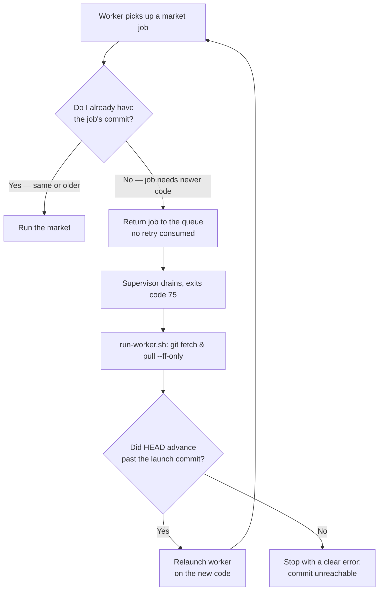

# Worker Self-Update

A backtest worker is a long-running process. When it starts, it loads the
strategy registry into memory **once**. Anything you add or change afterwards is
invisible to that running process until it restarts — so a freshly written
strategy fails with `unknown strategy id=…`, and a worker on another machine
that is still on old code fails the same way.

Worker self-update removes that manual step. Each worker keeps itself on the
code its jobs need: it runs what it can, and when a job requires newer code it
**pulls and relaunches by itself**. No process manager, no cron, no `pm2`.

Remote fleets can also be updated proactively with Ansible before jobs arrive.
That is documented separately in
[Worker Fleet Ansible](/backtest/fleet/ansible); the commit gate on this
page remains the correctness layer.

::: tip Default market concurrency
When `--market-concurrency` is not given, `run-worker.sh` resolves it from
`dashboard/src/data/machines.json`: this machine's `cores_for_backtest`
(matched by `node-machine-id`, the same identity the worker reports to the
dashboard), falling back to `cores - 2` when the machine is unknown there or
the field is `null`. An explicit flag always wins. Human shortcuts:
`npm run worker:markets` and `npm run worker:aggregate`.
:::

## The idea in one line

> Run any job whose code I already have. If a job needs newer code, update and
> restart.

That is the whole model. The rest of this page explains how it is enforced and
what to do when it can't update.

## How it flows



## How a worker decides

Every market job carries the **producer's commit SHA** — the commit that was
checked out when the backtest was launched. Before replaying a market, the
worker asks one question: *do I already have that commit's code?*

The answer is a local Git check (`git merge-base --is-ancestor`, no network):

- **The job's commit is the same as, or an ancestor of, the worker's code** →
  the worker already has that code (or newer), so it **runs the job**.
- **The job's commit is newer** (not in the worker's history) → the worker is
  behind, so it **triggers a self-update**.

Because strategies are only ever **added** — never removed — a worker on the
latest `main` is a superset of every older commit. That is what lets a single
worker drain a queue full of batches enqueued at different commits: it runs them
all on its current code and only updates when a job genuinely needs something
newer.

::: tip Why "the commit it loaded", not "the files on disk"
The worker compares against the commit it **loaded its code at** (captured once
at startup as `WORKER_LAUNCH_SHA`), not a live `git rev-parse HEAD`. On your own
machine the files on disk change the moment you commit, while the running
process still holds the old strategy registry in memory. Comparing against the
loaded commit is the only check that stays correct in that window.
:::

## How the update happens

When a worker decides it is behind:

1. It returns the job to the queue with a short delay (`moveToDelayed`) — **no
   retry attempt is consumed**, and the job never counts as "stalled".
2. It tells its supervisor it needs to update.
3. The supervisor drains its children and exits with code **`75`**.

The **aggregate** worker uses the exact same gate: before finalizing a batch it
checks the aggregate job's commit, and self-updates the same way if it loaded
older stats/engine code. So both market and aggregate workers stay current
automatically.

Code `75` is a signal to the launcher script, `scripts/run-worker.sh`, which
wraps the worker:

```bash
./scripts/run-worker.sh --queues markets
```

On exit `75` the wrapper runs `git fetch && git pull --ff-only`, reinstalls
dependencies only if `package-lock.json` changed, and relaunches the worker on
the new code. Any other exit code stops the loop and is propagated, so a real
crash or a `Ctrl-C` is never mistaken for an update.

### The loop guard

A restart only helps if it loads a **different** commit than the worker just
ran. If the pull does not advance `HEAD` past the launch commit — a dirty tree,
a diverged or wrong branch, no network, or a producer commit that was never
pushed — relaunching would just exit `75` again forever. The wrapper detects
this and **stops with a clear, non-zero error** instead of looping:

```
[run-worker] ERROR: update requested but HEAD is unchanged (still 4fafed26).
[run-worker] The worker cannot reach the commit its jobs need. Push the commit,
[run-worker] clean the tree, or switch to the tracked branch, then restart.
```

## Running workers

Launch every long-lived worker through the wrapper — locally and on remote
machines, with the same flags you would pass to `npm run backtest:worker`:

::: code-group
```bash [local]
./scripts/run-worker.sh --queues markets
```
```bash [remote / sibling]
# Markets only; no DB or trading credentials needed.
./scripts/run-worker.sh --queues markets
```
:::

On your own machine the worker never errors out: the commit it needs is always
present locally, so it simply relaunches onto your latest commit. The "commit
unreachable" stop only happens on a machine that cannot fetch the required
commit.

To smoke-test the path after a merge, leave a worker running on the old commit
and enqueue any BullMQ backtest from the new `main`; the first stale job should
defer itself and trigger the wrapper relaunch.
The worker log should show the stale job being deferred before the wrapper pulls
and starts the process again.
After relaunch, the worker's startup line should print the new commit SHA.

For proactive updates before the first job reaches a stale worker, use
[Worker Fleet Ansible](/backtest/fleet/ansible).

## The one rule: commit and push first

The whole mechanism keys off the producer's commit SHA, so **uncommitted code is
invisible to workers**. To enforce this, the BullMQ producer refuses to enqueue
a backtest when the working tree is dirty:

```
[backtest] Working tree has uncommitted changes.
  Distributed workers gate on the commit SHA, so uncommitted strategy code will
  NOT reach them — they would run a stale strategy registry.
```

So the daily loop is: **write a strategy → commit → push → run the backtest.**

- On a **single machine**, committing is enough (the worker has the commit
  locally and relaunches onto it).
- With **remote workers**, you must also **push** — a worker on another machine
  can only reach a commit that exists on the shared remote.

::: warning Committed but not pushed
The dirty-tree guard catches *uncommitted* changes, but not a commit you forgot
to push. Local workers will run it; remote workers cannot fetch it and will stop
with the "commit unreachable" error. When in doubt, push.
:::

To bypass the guard for a quick local run, set `BACKTEST_ALLOW_DIRTY=1` — only
safe with `--sequential`, which does not use workers at all.

## When a worker stops

| Symptom | Cause | Fix |
| --- | --- | --- |
| `commit unreachable` error, worker exits | The job needs a commit this machine can't reach (unpushed, dirty tree, or wrong branch). | Push the commit, clean the tree, or switch the checkout to the tracked branch, then restart. |
| Worker keeps running old strategies | You committed but a worker hasn't been sent a job needing the new code yet. | Expected — the worker updates lazily, on the first job that needs newer code. |

## What the dashboard shows

Each worker publishes its **loaded** branch and commit (not a live `HEAD`) plus
whether that commit matches `origin/main`. The dashboard's Workers table shows a
"Branch" badge and a colored "Commit" badge per process — green when the worker
is on the latest `main`, amber when it is behind. See
[Parallelization](/backtest/parallelization#dashboard).

## Reference

| Item | Value | Where |
| --- | --- | --- |
| Self-update exit code | `75` | `src/cli/backtestWorker.ts` |
| Launcher / relauncher | `scripts/run-worker.sh` | repo root |
| Proactive fleet update | `npm run fleet:update` | see [Worker Fleet Ansible](/backtest/fleet/ansible) |
| Commit gate | `canRunJobCommit` → `isAncestorOrEqual` | `src/backtest/commitGate.ts`, `src/backtest/workerIdentity.ts` |
| Loaded-commit env | `WORKER_LAUNCH_SHA` | stamped by the supervisor onto children |
| Loaded-branch env | `WORKER_LAUNCH_BRANCH` | stamped by the supervisor onto children |
| Producer dirty guard override | `BACKTEST_ALLOW_DIRTY=1` | `src/cli/backtest.ts` |

## See also

- [Running Backtests](/backtest/running-backtests) — flags, env, execution modes
- [Parallelization (BullMQ)](/backtest/parallelization) — the worker pool and dashboard
- [Distributed Workers](/backtest/fleet/overview) — running workers across machines
