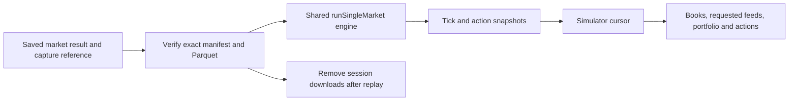

# Market simulator

Open a backtest run in the dashboard and click **Simulator** beside a market's slug.
The page recreates that one market using the saved strategy artifact and parameters,
then lets you inspect the resulting trace. It does not place live orders or create a
new backtest run in the database.

## Playback

- Play/pause at 1×, 3×, 5× or 10× market time.
- Step backward/forward one strategy tick, or jump to the next action or fill.
- Drag the timeline or click a chart to seek. Click an execution event to see the
  portfolio immediately after that event, including multiple events on one tick.
- UP/DOWN charts show bid, ask, fill markers and the currently active order levels.
  Zoom to the last 60 or 15 seconds for a closer look. Future prices are hidden.
- The order panels distinguish requested, resting, partially filled and cancellation
  requested orders. The timeline retains acknowledgements, rejection reasons and
  the original intent/fill metadata.
- External feeds show the historical snapshot seen by the strategy at the selected
  point. Recorder V4 supplies captured Binance trades and best bid/ask, Chainlink spot
  and TWAP, and website/opening-TWAP price-to-beat observations in original receipt order.
  The feed cards show only values requested and seen by the strategy; values stay unavailable
  until receipt. Historical input modes retain their existing feed loaders. Missing inputs
  fail preparation rather than being replaced with live prices.

The engine processes every original meaningful tick, in the same order as a normal
backtest, including any requested synthetic feed ticks. Only the chart overview is
reduced: each second retains its first/last quotes and bid/ask extrema. The detail
panel retains the top ten book levels per side; execution still uses the full depth.

## Recorder V4 input identity

New V4 results save the exact manifest, recording ID, canonical manifest checksum,
input location, strategy feed requirements, gap-admission setting, and settlement used by
the backtest. The simulator verifies both manifest identity and event-file bytes/checksum.
It never selects a different recording simply because it has the same market slug. A later
resolution observation does not change the settlement used by an already-saved result.

Older runs can recover an input only when their saved command names one unique,
content-addressed R2 manifest for that market. Local-directory or catalog selections without
an immutable saved reference require a new backtest. Preparation also fails if current
registry strategy code requests different feeds from the saved V4 strategy; use its saved
artifact or run a new backtest. No saved shell command is executed.

The verification panel shows recording identity, required feeds, capture gaps, and whether
outage replay was explicitly admitted. Required-feed gaps fail normal preparation. A run
launched with `--allow-capture-gaps` can reproduce those outages. Final resolution is hidden
until **Reveal final winner**; it is settlement-only and is never supplied as strategy feed data.



## Accounting and verification

Paired shares are `min(UP quantity, DOWN quantity)`. The surplus on either side is
unpaired inventory. Remaining cost basis comes from the shared Portfolio.

The **Market capital** panel shows the engine's starting capital, cash, reserved cash
and available cash at the selected tick or event. It captures the same snapshot seen
by the strategy, including unapplied BUY/split commitments, applicable fee reserves
and holds awaiting final fill reconciliation. Seeking restores the captured amounts;
the browser does not estimate reservations from visible orders. Older cached traces
without these snapshots show unavailable values and offer **New replay**.

Capital rejections retain the engine's exact required and available amounts at the
funding check. Selecting one explains the shortfall alongside the raw event. These
amounts can differ from the later account-event state if other actions intervened.

The engine enforces the per-market `startingCapital` allowance. Replay
uses the recorded `--starting-capital` value; if absent, it reports that the current
environment/default allowance is being substituted. This can change results for
older runs that predate capital enforcement. The allowance is shown in replay
settings and is independent of both the run's aggregate initial capital and the live
wallet balance. Conditional settlement PnL remains net fill/split/merge cash flow plus
the winning shares; it can differ slightly from saved PnL because Portfolio rounds
accounting entries.

The verification section compares PnL, costs, fees, holdings, pairs, maker/taker fills
and processed-event count with the saved market row. A mismatch remains visible and
does not prevent inspecting the reconstructed path.

Historical runs saved totals, not their original event trace. Therefore even matching
totals are labeled **reconstructed replay**, not exact historical playback. The page
records the strategy artifact hash, engine commit, source fingerprint, input parquet
hash, parameters, ordering, latency and current risk/feed settings. It identifies
missing original provenance and current-source substitutions. Nonzero jitter is
unseeded and can produce different results. No recorded shell command is executed.

## Operation

Use the existing `npm run dashboard` command on a host with Node 20, this repository,
its installed dependencies, database access, and the usual historical data/R2 access.
Use an application/database version containing the V4 provenance migration. No separate
simulator service is required; fleet backtests must use the same released engine version.

Preparation runs in a separate child process through `runSingleMarket`, keeping the
dashboard responsive. One replay runs at a time; up to six requests may be active or
queued. Duplicate pending requests for the same run/market share a job. Completed
sessions are not silently reused for new requests; a URL containing a session id can
reopen that captured trace. **New replay** verifies the saved V4 input again. Historical
modes resolve their catalog inputs and retain the reconstruction warnings.

Display chunks and checkpoints are temporary files under `data/simulator-sessions/`.
Remote package downloads also live inside that session's `input/` subdirectory. They are
removed after replay, failure, or child-process termination; original local datasets are
never removed. V4 downloads over 2 GiB are rejected before download; an active download
size guard also checks other historical inputs. Both the dashboard and its child enforce the
five-minute deadline and 2 GiB input guard. The child exits and removes its downloads when
the parent disconnects, on cancellation signals, or when either limit is exceeded. A forced
OS kill cannot run cleanup; the next session-cache prune recovers that abandoned directory.
The browser holds at most three chunks, each containing up to 2,000 ticks. Seeking
restores display data without serializing or rewinding a strategy closure. Preparation
can be canceled; failures and dashboard restarts are reported explicitly.

Sessions expire lazily when another replay starts: at most nine completed sessions
are retained, with a 24-hour age limit and a 2 GiB completed-cache budget. A single
trace is limited to 512 MiB compressed, two million ticks and 100,000 actions; preparation
has a five-minute deadline. Exceeding a limit reports an error rather than dropping
engine input. Active sessions are not evicted by cleanup. A saved child PID protects a still-running
worker during a dashboard restart. Recursive accounting includes interrupted download
subdirectories; symlinks are not followed when counting storage.

## Dataset and run coverage

Select **Recorder V4** on **Backtest Datasets** to inspect production BTC 5m/15m packages,
compressed file sizes, official-resolution availability, feed-gap counts, and orderbook
eligibility/exclusion reasons. Browsing defaults to the latest seven days and accepts up to
31 UTC days per request. Metadata reads are reused for five minutes and coalesced per scope.
The dashboard never downloads Parquet just to render coverage.

V4 run coverage shows the verified eligibility summary saved when markets were selected,
alongside completed results. Current catalog metadata is separate: requested PTB observations
require event inspection, so those packages are shown as needing verification instead of
being counted as eligible. The backtest selector performs the full check before launching jobs.
For strategies without pending PTB verification, the existing coverage calendar and missing-market
list use the shared V4 eligibility rules. Duplicate recordings are excluded unless the selection
names one exact manifest. Telonex dataset and coverage behavior is unchanged.

Simulator APIs use the dashboard's existing allowed-host, same-origin and optional
`MISSION_CONTROL_TOKEN` protection. Only an existing run/market identity is accepted;
HTTP callers cannot provide executable code, strategy parameters or filesystem paths.

## Validation

Initial acceptance, before per-market capital enforcement was added to the engine,
replayed all ten markets in run **8180**, including all four losses.
Every saved metric and event count matched. The traces contained 65,387–128,222
strategy ticks per market, took approximately 1.9–4.0 seconds to capture, and occupied
3.0–5.9 MB compressed on the development host.

Real Recorder V4 validation also replayed the exact BTC 5m capture starting at
`1791284400` and BTC 15m capture starting at `1791288900` through the sequential CLI,
a temporary MySQL database, and this simulator. All eleven saved comparisons matched
for both `SplitSellRedeem.v5` and the all-feed observer. The 275,526 strategy frames
preserved receipt order; scanning their feed snapshots found no observation before
its receipt. Opening TWAP and website PTB became available at different ticks, as
recorded. A separate `--extend` run inherited its original mixed-duration source list,
added the uncovered 15m market, and preserved identical capture references and results.

Focused tests cover observer parity, partial fills, account-triggered decisions,
synthetic ticks, cash flow, duplicate fills, chunk checkpoints, backward/equal clocks,
event-specific feed context and bounded browser caching. V4 fixture tests compare both 5m
and 15m CLI execution with simulator traces, including all requested feeds, same-clock
receipt ordering, earlier cursor snapshots, fills and gap admission. Metadata tests ensure
coverage never reads Parquet or treats unverified PTB observations as eligible:

```sh
node --import tsx --test src/backtest/simulator/*.test.ts dashboard/src/lib/server/simulatorPlayback.test.ts
npm run trading:test
npm run dashboard:test
npm run code:typecheck
npm run dashboard:typecheck
npm run dashboard:build
```
