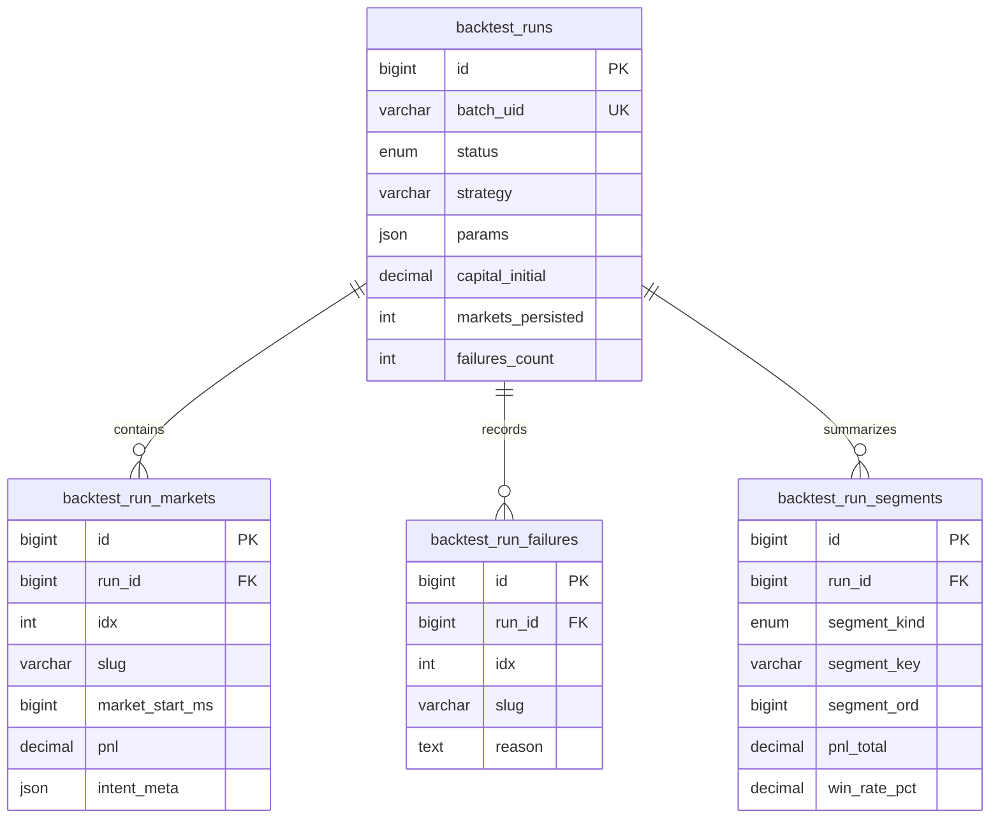

# Backtest Result Storage

Backtest results are stored in four normalized tables:

- `backtest_runs` — one terminal run row.
- `backtest_run_markets` — one row per market result inside that run.
- `backtest_run_failures` — one row per market job that exhausted retries.
- `backtest_run_segments` — computed run-level and per-segment statistics.

The old monolithic `backtests.market_stats` and `backtests.batch_stats` JSON
snapshots are not part of the current result schema.

## Data Model

## `backtest_runs`

`backtest_runs` is the top-level row for a completed, partially completed, or
failed run.

### Identity And Lifecycle

| Column      | Type                                  | Description                                      |
| ----------- | ------------------------------------- | ------------------------------------------------ |
| `id`        | `BIGINT`                              | Surrogate primary key.                           |
| `batch_uid` | `VARCHAR(255)`                        | Unique run identifier used by CLI and dashboard. |
| `status`    | `ENUM('completed','partial','failed')` | Terminal status derived from market/failure counts. |

### Reproducibility

| Column        | Type           | Description                                                       |
| ------------- | -------------- | ----------------------------------------------------------------- |
| `strategy`    | `VARCHAR(255)` | Strategy id used for the run.                                     |
| `params`      | `JSON`         | Strategy parameter object.                                        |
| `baseline_id` | `VARCHAR(255)` | Optional baseline identifier for research/diff workflows.         |
| `cmd`         | `LONGTEXT`     | Effective command used to launch the run.                         |
| `comment`     | `TEXT`         | Optional user comment.                                            |

### Input Selection

| Column   | Type          | Description                                      |
| -------- | ------------- | ------------------------------------------------ |
| `symbol` | `VARCHAR(10)` | Asset symbol filter such as `btc`, `eth`, `sol`. |
| `slugs`  | `JSON`        | Explicit market slug list when provided.         |
| `limit`  | `INT`         | CLI limit when the run was bounded by count.     |
| `random` | `BOOLEAN`     | Whether random market ordering was requested.    |
| `latest` | `BOOLEAN`     | Whether latest market selection was requested.   |

### Cardinality And Audit

| Column                 | Type  | Description                                                                    |
| ---------------------- | ----- | ------------------------------------------------------------------------------ |
| `input_markets_total`  | `INT` | Requested input size when known: `limit` or explicit `slugs.length`.           |
| `markets_persisted`    | `INT` | Number of successful market result rows written to `backtest_run_markets`.     |
| `failures_count`       | `INT` | Number of failed market jobs written to `backtest_run_failures`.               |

`markets_persisted` is not the same as `markets_total` from run statistics.
`markets_persisted` is a storage/audit count. `markets_total` is the statistic
denominator produced by `computeBatchStats`.

### Per-Segment Stats

Computed stats live in `backtest_run_segments`. The full-run totals are the
`segment_kind = 'all'` / `segment_key = 'all'` row; last-N tails and calendar
buckets use the same typed stat columns. See
[Backtest Segments](/backtest/statistics/backtest-segments) and
[Backtest Run Statistics](/backtest/statistics/run-statistics). The previous
`chunked_batch_stats` JSON column was removed in favor of this table.

## `backtest_run_markets`

`backtest_run_markets` stores each per-market result row. Stable values are
columns; strategy-specific intent metadata remains JSON.

See [Backtest Run Markets](/backtest/statistics/run-markets) for the full column reference.

## `backtest_run_failures`

`backtest_run_failures` stores market jobs that exhausted retries in the
parallel runner. This lets a run finalize as `partial` while preserving an
audit trail of missing markets.

| Column       | Type           | Description                                      |
| ------------ | -------------- | ------------------------------------------------ |
| `id`         | `BIGINT`       | Surrogate primary key.                           |
| `run_id`     | `BIGINT`       | Foreign key to `backtest_runs.id`.               |
| `job_id`     | `VARCHAR(255)` | BullMQ job id when available.                    |
| `idx`        | `INT`          | Producer-assigned market index when available.   |
| `slug`       | `VARCHAR(255)` | Market slug when available.                      |
| `reason`     | `TEXT`         | Failure reason captured by the aggregate worker. |
| `created_at` | `TIMESTAMP`    | Failure row creation time.                       |

## Hydration Helpers

`getBacktestRunById` and `getBacktestRunByBatchUid` hydrate normalized rows into
the shape expected by research and diff tooling:

- run metadata from `backtest_runs` and scalar statistics from the `all` segment,
- ordered `marketStats` from `backtest_run_markets`,
- `failedMarkets` from `backtest_run_failures`.

Per-segment stats are read via `listSegmentsForRun(runId)` from `backtest_run_segments`.

Hydration is a compatibility boundary for tools. The database schema remains
the source of truth.
