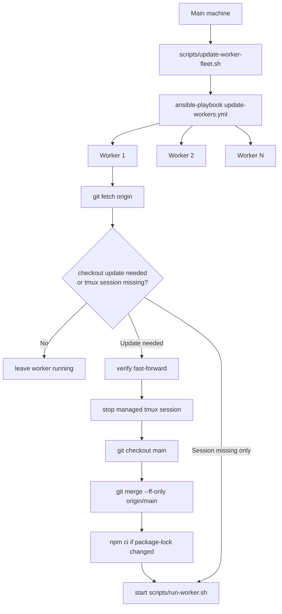

# Worker Fleet Ansible

Worker self-update is intentionally lazy: a worker updates when it receives a
job whose producer commit is newer than the code it loaded. That is the
correctness layer. It prevents a stale worker from running a strategy registry
that cannot contain the job's strategy code.

Ansible is the operational layer on top. It lets you update workers before they
receive a job, so the fleet is already on fresh `origin/main` when you launch a
backtest. The commit gate still remains active, so proactive updates improve
operator workflow without weakening determinism.

## What This Solves

Without Ansible, a quiet worker can stay on old code indefinitely. That is safe:
the first new-code job will be delayed, the worker will exit with code `75`, and
`scripts/run-worker.sh` will pull and relaunch it. But it costs time at the
start of the run, and stale workers are visible on the dashboard until they are
given work.

With Ansible, you can run one command after merging or pushing:

```bash
./scripts/update-worker-fleet.sh
```

That command connects to every worker in the inventory, fast-forwards the repo,
installs dependencies only if needed, and restarts the managed worker process.

## Architecture



`scripts/run-worker.sh` is still the process that runs the worker. Ansible does
not bypass it. That matters because the wrapper already knows how to handle
worker exit code `75`, reinstall dependencies after lazy self-update, and avoid
infinite relaunch loops when a needed commit is unreachable.

## Files

| File | Purpose |
| --- | --- |
| `ops/ansible/update-workers.yml` | The playbook that updates and restarts worker machines. |
| `ops/ansible/inventory.example.ini` | Example inventory. Copy it to `inventory.ini` and edit hosts. |
| `ops/ansible/ansible.cfg` | Local Ansible defaults used by the wrapper. |
| `scripts/update-worker-fleet.sh` | Local wrapper that runs the playbook against `ops/ansible/inventory.ini`. |

`ops/ansible/inventory.ini` is intentionally ignored by Git because it can
contain private hostnames, users, IPs, or per-machine command overrides.

## Inventory

Create your local inventory:

```bash
cp ops/ansible/inventory.example.ini ops/ansible/inventory.ini
```

Example:

```ini
[backtest_workers]
worker-1 ansible_host=worker-1
worker-2 ansible_host=100.64.0.25 backtest_worker_command="./scripts/run-worker.sh --queues markets --market-concurrency 8"
```

The default variables are:

| Variable | Default |
| --- | --- |
| `backtest_repo_dir` | `~/Sites/polymarket-bot` |
| `backtest_branch` | `main` |
| `backtest_remote` | `origin` |
| `backtest_worker_session` | `polymarket-backtest-worker` |
| `backtest_worker_command` | `./scripts/run-worker.sh --queues markets --market-concurrency 5` |

Override `backtest_worker_command` per host when different machines should use
different concurrency or queue ownership.

## Managed tmux Session

The current version uses a named tmux session instead of `launchd`:

```text
polymarket-backtest-worker
```

The playbook starts it like this:

```bash
tmux new-session -d \
  -s polymarket-backtest-worker \
  -c "$repo" \
  "exec ./scripts/run-worker.sh --queues markets --market-concurrency 5"
```

If a worker is currently running manually in another terminal or tmux pane, stop
that process once before switching to the managed session. After that, the
playbook owns the session and restarts it only when code changed or when the
session is missing.

## Update Flow

For each host, the playbook:

1. Verifies the repository exists.
2. Fails if tracked files are dirty.
3. Reads the current `HEAD`.
4. Fetches `origin`.
5. Checks whether the managed tmux session exists.
6. Decides whether the checkout must change or the session is missing.
7. Verifies the target branch can fast-forward to `origin/main`.
8. Stops the managed tmux session before any working-tree mutation when a
   checkout update is needed.
9. Checks out `main` and runs `git merge --ff-only origin/main`.
10. Runs `npm ci` only if `package-lock.json` changed.
11. Starts the managed tmux session when code changed, branch changed, or the
    session was missing.

This is deliberately conservative. A dirty or diverged checkout is an operator
problem, not something the playbook should repair automatically.

## Running It

Normal update:

```bash
./scripts/update-worker-fleet.sh
```

The wrapper prints total elapsed time and the Ansible exit code at the end:

```text
[update-worker-fleet] elapsed=00:00:18 exit=0
```

Pass Ansible flags through the wrapper:

```bash
./scripts/update-worker-fleet.sh --check
./scripts/update-worker-fleet.sh --limit worker-1
./scripts/update-worker-fleet.sh -v
```

Use another inventory file:

```bash
ANSIBLE_INVENTORY=/path/to/inventory.ini ./scripts/update-worker-fleet.sh
```

## Failure Modes

| Symptom | Cause | Fix |
| --- | --- | --- |
| `Repository not found` | The worker was not provisioned yet, or `backtest_repo_dir` is wrong. | Clone the repo or override `backtest_repo_dir`. |
| `Tracked working tree is dirty` | Local edits exist on the worker checkout. | Commit/stash/remove them, or use a separate experimental checkout. |
| `cannot fast-forward` | The worker branch diverged from `origin/main`. | Inspect the branch manually; do not let automation guess. |
| `tmux: command not found` | tmux is missing on that worker. | Install tmux or move to a launchd-based worker manager later. |
| Worker still shows old commit | The managed session was not the process shown on the dashboard. | Stop old manual workers and let the managed tmux session be the only worker process. |

## Warnings

The wrapper uses `ops/ansible/ansible.cfg`, which sets
`interpreter_python = auto_silent`. This suppresses Ansible's noisy Python
interpreter discovery warning on macOS workers. It does not pin a specific
Python path; if a worker later has a broken Python install, Ansible will still
fail when it cannot run modules.

Deprecation warnings are also disabled for this fleet command so normal update
output stays focused on host state.

## Dashboard

Workers publish the branch and commit they loaded at startup. The dashboard
shows both:

- **Branch** — the loaded branch name, usually `main`; detached checkouts show
  `detached`.
- **Commit** — the loaded commit SHA; green means it matches `origin/main`,
  amber means it is behind or unknown.

These are loaded values, not live `git rev-parse` values. If Ansible advances
files on disk but a process has not restarted yet, the dashboard still shows
the old loaded commit, which is the correct signal.

## Relationship to Self-Update

Ansible does not replace [Worker Self-Update](/backtest/worker-self-update).

- Ansible keeps the fleet fresh before jobs arrive.
- Self-update protects correctness when a worker is still stale.
- The producer dirty-tree guard still prevents uncommitted strategy code from
  being enqueued into distributed workers.

The invariant stays the same: workers either run code that contains the job's
producer commit, or they defer the job and relaunch.

## Future Extensions

This page is the place to continue the worker fleet work. Good next additions:

- `provision-worker.yml` for Homebrew, Node.js, tmux, repo clone, and `.env`.
- `launchd` instead of tmux for reboot-safe workers.
- Separate inventories for markets-only workers and aggregate-capable machines.
- Data prewarm commands for converted parquet files.
- Fleet health checks that compare dashboard heartbeats with Ansible inventory.
