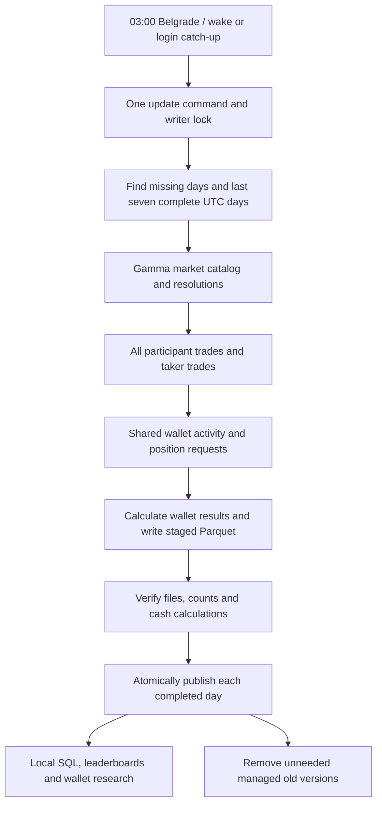

# Polymarket research data

This system downloads Polymarket trades, activities, positions and market details
into local Parquet files. You and your agents query those files with DuckDB,
without making API requests for each analysis.

**Normal research includes every observed trading wallet.** Leaderboards show
wallet, calculated profit, market count and trade count. Internal reconciliation
checks remain available to maintain the system, but do not exclude wallets or
add warning columns to normal results.

BTC 15-minute is the only enabled market family. The initial June–September 2026
backfill contains 122 days, 11,712 markets and 37.12 million participant trade rows.
The [nightly updater](./downloading) keeps later days current. Use `research:status`
and `research:coverage` for the actual current endpoint of your local dataset.

## How it works

Downloads use public Gamma and Data API v2 endpoints. They need no trading keys
and do not use blockchain downloading. The research files are separate from
orderbook recordings and strategy replay. They do not change trading/backtest
logic or provide a substitute for its tick stream.

## Start here

1. [Download and nightly update](./downloading): the one daily command and its schedule.
2. [Stored data](./schema): the six Parquet tables, positions and derived monthly view.
3. [Profit calculations](./accounting): what a daily or monthly profit means.
4. [Commands and research examples](./commands): rankings, wallet history and SQL.
5. [Operations and upgrades](./operations): failures, disk space, retention and releases.
6. [Performance](./performance): measured running time and request limits.
7. [Research skill](./research-skill): rankings, comparisons and wallet strategy investigations.

The project-local `polymarket-research` skill uses these same definitions and the
[analyst instructions](./agents/analyst). Invoke it for local wallet studies,
including investigating possible trading strategies.

## Research periods

Dates select **market-window starts in UTC**. A June analysis includes the full
observed lifecycle of markets that started in June, including later redemption.
A daily or weekly query uses the same calculation over a smaller date range.
There is no separate monthly download or monthly profit database.

Queries read immutable published generations. Failed refreshes leave the previous
published day readable. Source payloads remain available in `raw_json`; the
[internal audit reference](./accounting-audit) explains the retained diagnostics.

The [initial completion evidence](./completion-evidence), [historical studies](./monthly-wallet-study)
and [API investigations](./api-limitations) retain the methods and source observations
from the original backfill. Their strict ranking populations are historical and
are not the default research population today.
