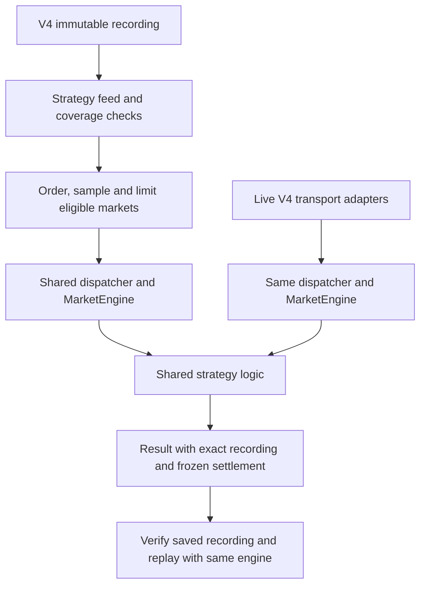

# Recorder V4 integration validation

This follow-up adds V4 eligible-market selection, extensions, saved recording identity,
interactive simulator replay and the V4 feed runtime for live strategies. It also bounds
service logs, simulator downloads and eligibility-cache storage. The original compact
format and R2 namespace stay unchanged. Initial capture/deployment evidence is in the
[original validation report](./recorder-v4-validation).

## Shared processing and input identity

Admission checks occur before a limit is applied. Unsupported feeds, unresolved results,
missing required observations, gaps and ambiguous duplicate recordings have explicit
exclusion reasons. Ordinary runs skip incomplete required-feed coverage; explicit outage
runs retain their original gap-admission setting. A preview cannot publish a strategy:
`--list-eligible` accepts a registry strategy or an already-published artifact.

Every new persisted V4 market result saves the exact recording ID, canonical manifest
checksum, event checksum and size, original input location, required feeds, outage policy
and settlement used by that backtest. The simulator verifies this identity and never picks
another recording by slug. Database JSON key reordering does not change the canonical hash.

The live runtime binds feed values to each tick before asynchronous strategy processing.
Controlled tests cover both BTC durations, both PTB sources, identical-clock receipt order,
missing observations, reconnects, market rotation and shutdown during discovery. Independent
recorder and bot sockets may receive different real-world inputs; shared processing only
promises equivalent semantics for identical inputs. Real-money execution remains subject
to the [existing CLOB migration blocker](/live-trading/live-trading-bot).

## Verification performed

The October 6 local regression run passed **223 recorder tests, 296 trading/backtest tests,
66 dashboard tests and 34 operations tests**. Root TypeScript/ESLint and the dashboard
production build passed. The trading suite now includes the V4 extension planner and
result-duration tests. Focused simulator fixtures compare both durations against ordinary
backtest execution, including fills and tick-scoped external feeds.

A six-minute feed-only live check processed **348,613 strategy callbacks** across two
5-minute markets. Binance trades/best bid-ask, Chainlink spot/TWAP, selected opening TWAP
and website comparison observations appeared. One Polymarket disconnect reconnected;
there were no runtime failures. The check stopped all transports cleanly. It imported the
feed runtime directly and never created a trading execution adapter or submitted orders.

Real production R2 selection admitted two complete settled 5-minute captures with opening
TWAP requested, selecting one after eligibility checks. This exposed a boundary bug in the
new selector: healthy producer bootstrap callbacks were received 4–6 ms after the boundary.
Admission now uses the producer's explicit feed-gap evidence instead of demanding an exact
wall-clock callback. A regression fixture preserves that case.

Independent reviews also found and corrected a mixed-duration extension narrowing bug,
preview strategy-publication side effects, temporary-download recovery, cache capacity,
and dashboard worker lifecycle handling. These checks establish the tested behavior; they
do not guarantee future upstream delivery or replace a longer production observation period.

## Real recording to database to simulator

An isolated temporary MySQL 8.4 instance received schema definitions only from production,
then migration 0039. Actual sequential CLI runs used the unchanged `SplitSellRedeem.v5`
with zero latency/jitter and a per-market starting allowance of 1,000. They used these
settled production recordings through read-only R2 access:

| Market                      | Parquet bytes | Strategy ticks | Simulator trace bytes | Observed replay time |
| --------------------------- | ------------: | -------------: | --------------------: | -------------------: |
| `btc-updown-5m-1791284400`  |     2,509,534 |        106,499 |             4,917,750 |                5.2 s |
| `btc-updown-15m-1791288900` |     4,597,310 |        169,027 |             8,439,892 |                7.5 s |

Both markets persisted successfully with exact input references. All 11 saved-statistic
and event-count comparisons matched in simulator replay. The 15m run included one taker
trade; saved and replayed PnL were both 1.89 with fees of 0.11. This is a mechanics check,
not evidence of strategy profitability. Timing includes trace preparation and is not a
controlled format benchmark.

A complete scan of 275,526 trace frames verified nondecreasing receipt/ingest order and
that no displayed feed observation arrived after its frame. Website PTB remained absent
for the first 378 ticks of the 5m replay and 196 ticks of the 15m replay, then appeared at
its recorded receipt. Both session download directories were removed after preparation.
A separate CLI run limited to the 5m capture extended successfully to include the 15m
capture; its combined results matched the original two-market run.

Browser verification used the same temporary database. The V4 dataset page displayed
production package sizes, resolution availability and coverage exclusions. The simulator
reported matching totals; **Next fill** advanced to the recorded sale and updated the
portfolio and feed cards. Recording identity and required-feed gap policy were visible,
and final settlement stayed hidden until explicitly revealed.

An additional all-feed observer backtest and simulator run used both exact captures with
Binance aggregate trades/book ticker, Chainlink spot/rolling TWAP, selected opening TWAP
and website PTB requested. All saved comparisons matched. Scanning 275,526 frames checked
2,201,674 feed receipt timestamps with no future observations. Opening TWAP appeared at
ticks 560/133 and website PTB at ticks 378/196 in the 5m/15m markets respectively.
The browser feed cards reproduced that independent availability.

The actual trading CLI also passed separate 30-second BTC 5m and 15m checks with explicit
`DRY_RUN=true`, no wallet keys, no DB/R2 environment and the all-feed observer. Both selected
V4 automatically, exposed the requested feeds and exited cleanly on SIGINT. Website PTB
was selected for these mid-market starts; exact opening evidence was correctly unavailable.

The temporary MySQL server was shut down and its owned data removed after validation.
Small result/checksum summaries were retained separately. No production database or R2
writes were needed for these tests.

## Storage bounds

| Component                 | Bound and cleanup                                                                                                                                    |
| ------------------------- | ---------------------------------------------------------------------------------------------------------------------------------------------------- |
| Recorder service logs     | 8 MiB active file plus three 8 MiB archives: 32 MiB total; activation requires the updated service template                                          |
| PTB admission evidence    | 256 checksum-protected 64 KiB buckets: 16 MiB committed plus at most 64 KiB per active writer; dead-writer temporary files reclaimed on later writes |
| Admission downloads       | One candidate at a time; removed after inspection; owned dead-process directories recovered on the next cold scan                                    |
| Simulator input           | Session-owned downloads; 2 GiB input limit; removed after replay, failure or termination                                                             |
| Simulator trace           | 512 MiB per trace, two million ticks, five-minute preparation deadline                                                                               |
| Completed simulator cache | At most nine sessions, 24-hour retention and 2 GiB total; active sessions are protected                                                              |
| Dashboard catalog         | Five-minute cache, eight scopes; seven-day default and 31-day maximum query range                                                                    |

PTB admission may download each candidate Parquet on its first inspection. Subsequent
selections reuse compact verified evidence. Replay still verifies the original file.
The dashboard catalog reads metadata only and labels PTB checks requiring event inspection
as pending rather than presenting them as verified eligibility.

Worker-2's existing log measured only **492 bytes** after roughly three hours of production
recording. At that check it had 48 uploaded markets, no pending uploads and no archive error.
The recorder remained running throughout implementation. The new log bound protects future
operation; it is separate from the existing verified-upload event cleanup.

## Rollout requirements

Apply migration `0039_recorder_v4_replay_provenance` before starting the updated dashboard
or backtest processes. Its two nullable JSON columns preserve existing results. Finish old
queued jobs before updating producers and workers: the aggregate-job protocol advances to
version 6. New V4 simulations require provenance saved by the updated result writer; older
runs are recoverable only when their saved command names one unambiguous immutable R2 manifest.

Activate the bounded-log supervisor with a planned V4-only service update after installing
and validating its pinned release. Preserve the external V4 spool and all existing R2 data.
The [worker-2 runbook](./recorder-v4-worker-2) covers operation and rollback. V3 is retired and
must not be restarted as a rollback target.

## October 6 rollout evidence

[PR #296](https://github.com/ivanmijatovic89/polymarket-bot/pull/296) merged as
`a94e9a6a3d151546b56fcf4572858fe518f2f0ca` after all four CI checks passed.
The production migration journal records migration 0039 with checksum
`73cf6841cd04f5397c93ad159715b6540bcc0fb6faaf6c02ad7ea704f4c48cba`;
both provenance columns were verified as nullable JSON. The market and aggregate queues
were empty before rollout. The primary dashboard and local workers were restarted, and
worker-1, worker-2 and milan-m1 were fast-forwarded and restarted using the fleet updater.
All 17 market children and four supervisors reported the merged commit in fresh heartbeats.

Production queued validation run **9659** (`v4-post-rollout-20261006-a94e9a6a`) used the
all-feed observer and the same two immutable captures listed above. Both jobs succeeded
on worker-1 at the merged commit, with no failed/skipped markets and no orders. The
aggregate persisted selection metadata and both exact capture references. The production
dashboard simulator then matched all 11 comparisons for each duration, including capture
and event hashes. Scanning all 275,526 frames and 2,201,674 feed receipt timestamps found
no future observations; requested feeds appeared at their recorded arrival. Both simulator
processes exited and removed their temporary input downloads.

Worker-2's recorder remained on its original V4 release during the consumer rollout. Its
next pinned release was installed separately and passed 18 supervisor/updater checks,
typecheck, native DuckDB and exact plist validation. The operator completed the V4-only
service update at 15:44 UTC on October 6. Post-activation checks confirmed the merged
release, one supervisor and one recorder child, a fresh dashboard heartbeat and all six
feeds receiving for both durations. See the
[completed activation record](./recorder-v4-worker-2#completed-october-6-bounded-log-update).

By 15:47 UTC, four uploads had completed after startup, with no backlog or archive error.
Both new restart-spanning recordings had verified archive receipts and no remaining local
event file. They were correctly marked incomplete. The active 15m market had no gap at
that check; the active 5m market had one detected gap and remains excluded from ordinary
backtests. Website PTB and the captured opening TWAP matched in both active markets.
The bounded logger was active with a 1,023-byte log. These are startup checks, not a claim
that a full post-restart 15m recording had already completed.

A follow-up in this chat is scheduled to review the 24–48-hour production observation
period, including gaps, eligibility, uploads, resolution tracking, free disk and log growth.
No R2 deletion, overwrite or migration was part of this rollout.
