# Recorder V4 MySQL catalog

MySQL is the searchable recording catalog. R2 holds the immutable event Parquet, manifest,
and official-resolution sidecars. The independent catalog service imports existing and new
recordings. A MySQL outage cannot stop capture, upload, or recorder-local cleanup.

```mermaid
flowchart LR
    FEEDS[Polymarket / Binance / Chainlink / PTB] --> REC[Recorder on worker-2]
    REC --> R2[Verified immutable R2 packages]
    R2 --> SYNC[Independent catalog sync]
    SYNC --> DB[(MySQL catalog)]
    DB --> UI[Dashboard / eligible-market selection]
    UI --> JOB[Exact recording selected for a job]
    JOB --> WORKER[Fleet worker]
    R2 --> WORKER
    WORKER --> VERIFY[Checksum and eligibility verification]
    VERIFY --> REPLAY[Shared receipt-ordered replay]
```



## What is stored

Migration `0040_recorder_v4_mysql_catalog` adds two tables; it does not modify historical
Telonex catalogs or event files.

- `recorder_v4_recordings`: one row per bucket + exact immutable manifest key, identified by
  SHA-256. It stores market slug/symbol/timeframe/open/close, recording ID, exact R2 references,
  canonical manifest hash, event checksum/bytes/rows, full manifest and feed gap intervals,
  per-feed completeness flags, website PTB and exact opening-TWAP availability/evidence,
  latest official resolution (including reported settlement prices), and verification time.
- `recorder_v4_catalog_syncs`: initialization, last completed scan, current pass progress,
  pending import count and failed package keys. Missing or stale catalogs produce a clear
  selection error. The dashboard shows scan freshness and import counts.

A recording with gaps is retained and indexed. Eligibility remains strategy-specific and uses
the same shared rules as replay. Strict backtests still reject gaps in required feeds; this
change does not relax coverage, substitute TWAP for website PTB, or repair missed events.
Multiple recordings of one slug remain distinct; ambiguous automatic selection is rejected.

Reference evidence means *the requested observation was present in the verified recorded
stream*. Catalog metadata never becomes an initial strategy feed snapshot. The worker
rechecks event bytes and eligibility, then delivers feeds in recorded receipt order. Saved
jobs/results continue to pin the exact manifest rather than following mutable catalog rows.

## Synchronization and initial import

```bash
npm run record:v4:catalog -- sync --env-file /absolute/catalog.env --max-files 100
npm run record:v4:catalog -- sync --env-file /absolute/catalog.env --watch
npm run record:v4:catalog -- status --env-file /absolute/catalog.env
```

The configuration contains database (`DATABASE_HOST`, `DATABASE_PORT`, `DATABASE_USERNAME`,
`DATABASE_PASSWORD`, `DATABASE_NAME`) and R2 (`R2_ENDPOINT`, `R2_BUCKET`, `R2_ACCESS_KEY_ID`,
`R2_SECRET_ACCESS_KEY`) keys. No wallet/CLOB credentials are required. The prefix defaults to
`recorder-v4`; `--prefix` selects a specific child namespace. Production scans exclude child
validation namespaces. Use the dedicated [worker-2 service](./recorder-v4-worker-2#independent-mysql-catalog-service)
for continuous production synchronization.

Startup performs a full namespace scan. New recordings are downloaded sequentially to an
owned temporary directory, verified, inspected for reference evidence, committed to MySQL,
and removed locally. An interrupted process's owned downloads are reclaimed on the next
import once that process is confirmed dead. Importing all existing data therefore costs one
read of each previously unindexed event file; ordinary market selection does not repeat it.
Resolution changes refresh small sidecars without downloading event files again. Older
retries cannot overwrite newer outcome observations.

`--max-files` bounds new imports and outcome refreshes per pass. A one-shot command returns
nonzero for unfinished work or failed packages; repeat it or use `--watch`. The watch loop
continues partial full scans, checks recently opened markets every 60 seconds, and reconciles
the whole archive hourly. This also catches delayed uploads and late outcome corrections
outside the recent 30-minute range. A failed full scan is retried until complete. There is no
R2 PUT, DELETE, rename, or lifecycle change in this process. MySQL can be rebuilt from R2.

Normal discovery requires one complete initial full scan and a successful scan within the
last 15 minutes. These guards prevent selection from silently using an uninitialized or
abandoned index. Exact local packages and exact R2 manifest inputs remain available for
explicit recovery/diagnosis. A verified catalog entry records the last verification; the
worker still detects any externally deleted or altered R2 object at download time.

## Selection and fleet downloads

```bash
npm run backtest -- --input-mode recorder-v4 --read-from r2 \
  --strategy SplitSellRedeem.v5 --timeframe 5m --latest --limit 10 --list-eligible
npm run record:v4:data -- list --env-file .env --timeframe 15m --from 2026-10-07 --to 2026-10-08
npm run data:sync:worker -- --dataset recorder-v4 --market btc:5m --market btc:15m \
  --from 2026-10-07 --to 2026-10-08 --dry-run
```

`--read-from r2` still identifies where event files live; ordinary discovery now queries
MySQL. Both dashboard and CLI use the shared selector. Date/feed eligibility filtering happens
before latest/random/limit selection. See [fleet sync](../sync#recorder-v4-packages).
`record:v4:data --archive-scan` is the explicit read-only R2 diagnostic fallback;
`--manifest r2://.../manifest-SHA256.json` selects one exact independent package.

Useful read-only SQL:

```sql
SELECT timeframe, COUNT(*) AS recordings,
       SUM(complete) AS fully_gap_free,
       SUM(website_ptb_observed) AS website_ptb_available,
       SUM(opening_twap_available) AS opening_twap_available,
       SUM(outcome IS NOT NULL) AS resolved,
       SUM(events_bytes) AS event_bytes
FROM recorder_v4_recordings
WHERE bucket = 'polymarket-telonex' AND archive_prefix = 'recorder-v4'
GROUP BY timeframe;

SELECT slug, recording_id, website_ptb_observed, opening_twap_available,
       outcome, manifest_key, verified_at_ms
FROM recorder_v4_recordings
ORDER BY start_ms DESC LIMIT 20;
```

These counts are recording counts: a restart can produce multiple recordings of one market.
`complete` is overall capture coverage, not an all-strategy admission decision.

## Validation

`npm run record:v4:test` covers import idempotency, corruption rejection, database failure,
temporary cleanup, bounded catch-up, resolution refresh, namespace isolation, and shared
admission without R2 requests. The opt-in `CATALOG_TEST_MYSQL=1` integration test runs only
against an empty database named `recorder_v4_catalog_test` (or a suffixed test name); CI runs
it with MySQL 8.4. It exercises the real migration, concurrent transactions, MySQL JSON
roundtrips, official outcomes, filtering, and stale-catalog rejection.
