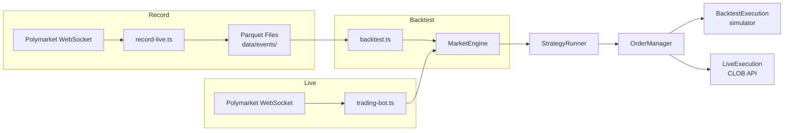
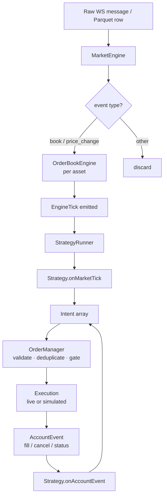

# How It Works

## The core invariant

The bot's most important design property is this: **live trading and backtesting run the exact same strategy code over the exact same event stream.**

When the recorder captures live WebSocket messages, it writes every raw event to a Parquet file. When the backtester runs, it replays those files through the identical `MarketEngine → StrategyRunner → OrderManager` pipeline that processes live data. The only difference is what sits at the end of the pipeline — a real CLOB API call or a fill simulator.

This means a backtest is not an approximation of live behavior. It is a deterministic replay of what actually happened.

## Three operating modes

| Mode         | Entry point      | Data source          | Execution         |
| ------------ | ---------------- | -------------------- | ----------------- |
| **Record**   | `record-live.ts` | Polymarket WebSocket | Writes to Parquet |
| **Backtest** | `backtest.ts`    | Parquet replay       | Simulated fills   |
| **Live**     | `trading-bot.ts` | Polymarket WebSocket | Real CLOB orders  |

## Data flow

Every market event — whether from a live WebSocket or a Parquet replay — flows through the same pipeline:

The loop from `AccountEvent` back to `Strategy.onAccountEvent` is the **cascade**: when a fill arrives, the strategy can immediately react by placing the next order within the same tick.

## The 15-minute market structure

Polymarket's BTC/ETH/SOL/XRP UP/DOWN markets resolve every 15 minutes. Each window has:

- A unique **slug** — `btc-updown-15m-<epochSeconds>` — that identifies the episode
- Two conditional tokens — **YES** (UP) and **NO** (DOWN) — each trading between 0¢ and 100¢
- A **resolution** at window close: the winning token redeems at 100¢, the losing token at 0¢

The bot subscribes to the current window's tokens at startup and rotates automatically when the window expires.

## Strategy execution model

Strategies receive two hooks:

- `onMarketTick(tick, portfolio, ctx?)` — fires on every `book` or `price_change` event; the orderbook snapshot is at `tick.snapshot`
- `onAccountEvent(event, portfolio, lastMarket?, ctx?)` — fires on fills, cancels, and order status changes

Both hooks return an array of **Intents** — typed instructions like `place_limit`, `cancel_order`, or `split_positions`. The `OrderManager` validates and executes them, enforcing risk limits, deduplication, and dry-run gating.

Plugins provide optional per-tick data (technical indicators, volatility, external price feeds) that strategies access through `ctx.plugins`. Plugin snapshots are computed once per tick and cached for the entire cascade.

## Execution modes

The bot supports two wallet configurations:

- **EOA** — the private key signs orders directly. Simpler setup, lower overhead.
- **Relayer / SAFE** — a SAFE multisig wallet holds funds; the EOA signs on its behalf. Required for larger positions where on-chain settlement and access control matter.

Both modes use the same strategy and engine code. The difference is only in how `LiveExecution` submits transactions.
