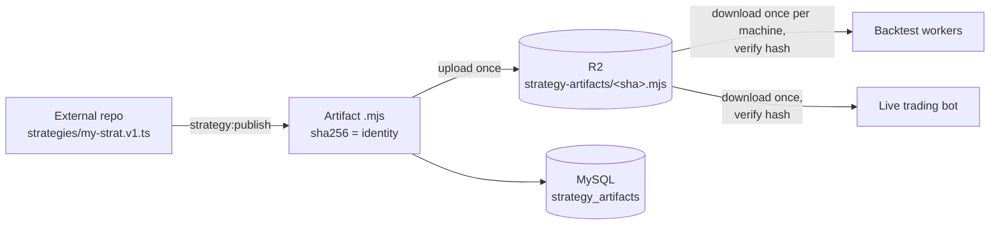

# External Strategy Artifacts

This guide shows how to keep a strategy's source of truth **outside** the `polymarket-bot` repository and still run it on the backtest fleet and the live trading bot — without committing any strategy file to `polymarket-bot/main`.

The mechanism is a **strategy artifact**: a single, immutable ESM bundle identified by the sha256 of its bytes. You publish it once; every machine that runs it verifies the hash before executing. Live trading and backtests load the exact same artifact through the same `StrategyDefinition` contract.



## What goes into an artifact — and what doesn't

The bundler follows every import of your entrypoint and decides by location:

| Import | Bundled? |
| --- | --- |
| The entrypoint itself | ✅ in |
| Other files in your repo (helpers, signals, …) | ✅ in |
| npm packages installed in your repo | ✅ in |
| Engine modules (`src/strategy/**`, `src/trading/feeds/**`, `src/market/**`) | ❌ external — rewritten to `#pmb/*`, filled by the **running machine's** engine |
| `zod` | ❌ external — the host's instance is used |
| Anything else under the engine's `src/` (e.g. `src/db/`) | 🚫 publish fails with an allowlist error |

Because engine imports stay external, there is exactly one copy of every engine class at run time — `instanceof`, plugin detection, and live/backtest parity all behave exactly as for in-repo strategies. Engine compatibility remains governed by the existing worker commit gate.

::: tip Params are not part of the artifact
The sha identifies **code only**. Ten backtests with ten different `--param` sets all reference the same artifact — no rebuilds, no re-uploads. A new sha exists only when the strategy code changes.
:::

## Set up the external repository

An external strategy repo needs three things: your strategy files, a `package.json` declaring ESM, and a `tsconfig.json` that points your editor at the engine.

```text
/Users/you/Sites/my-protocol/
├── package.json
├── tsconfig.json
└── strategies/
    └── my-strat.v1.ts
```

::: code-group

```json [package.json]
{
  "name": "my-protocol",
  "private": true,
  "type": "module"
}
```

```json [tsconfig.json]
{
  "extends": "../polymarket-bot/tsconfig.json",
  "include": ["strategies/**/*.ts", "../polymarket-bot/src/**/*.ts"]
}
```

:::

::: warning
`"type": "module"` is required — without it the engine's strict tsconfig treats your files as CommonJS and `strategy:check` fails. Installing `zod` locally is optional: `strategy:check` maps it to the engine's copy automatically.
:::

Write the strategy exactly like an in-repo protocol strategy, importing the engine through the sibling checkout:

```typescript [strategies/my-strat.v1.ts]
import { z } from 'zod'
import type { StrategyDefinition } from '../../polymarket-bot/src/strategy/strategyDefinition.js'
import { isWarmed } from '../../polymarket-bot/src/strategy/strategyToolkit.js'

export const definition: StrategyDefinition<{ size: number }> = {
  id: 'my-strat.v1',
  // z.coerce: `--param` values always arrive as STRINGS — plain z.number()
  // would reject `--param size=2` at launch.
  schema: z.object({ size: z.coerce.number().default(1) }),
  create: (params) => ({
    strategy: {
      name: `my-strat:${params.size}`,
      onMarketTick: () => [],
      onAccountEvent: () => [],
    },
  }),
}
```

The relative paths resolve on your machine, so autocomplete, go-to-definition, and typechecking work in your editor. At publish time they are rewritten to portable `#pmb/*` references.

## Check, publish, run

All commands run from the `polymarket-bot` checkout — the external repo needs no toolchain of its own.

### 1. Check

```bash
npm run strategy:check -- --repo /Users/you/Sites/my-protocol
```

Runs the engine's `tsc --noEmit` (over the engine `src/` plus your repo) and the engine's ESLint config against your files. Same strict rules as in-repo strategies.

### 2. Publish

```bash
npm run strategy:publish -- --repo /Users/you/Sites/my-protocol --entrypoint strategies/my-strat.v1.ts
```

The publish step:

1. captures git provenance (commit, remote, dirty state) — a dirty working tree is refused unless you pass `--allow-dirty`;
2. re-runs the typecheck pre-flight (skip with `--skip-checks`);
3. bundles the entrypoint into one deterministic `.mjs` and computes its sha256;
4. import-validates the bundle and rejects a strategy id that collides with a registry strategy;
5. uploads to R2 at `strategy-artifacts/<sha>.mjs` — skipped if the sha already exists;
6. inserts a provenance row into `strategy_artifacts`.

Publishing is idempotent: unchanged code produces the identical sha and prints `already published`. Use `--dry-run` to build and validate without uploading.

### 3. Run

```bash
npm run backtest -- --strategy-artifact <sha256> --input-mode telonex-delta --read-from local --symbol btc --limit 20
```

```bash
npm run trade:bot -- --strategy-artifact <sha256>
```

`--strategy-artifact` replaces `--strategy` (they are mutually exclusive); `--param` works unchanged and is validated against the artifact's own Zod schema. Distributed market jobs carry only the small `{sha256, r2Url}` reference — each worker machine downloads the artifact at most once into `data/strategy-artifacts/<sha>.mjs`, verifies the hash, and memoizes the loaded module per process. `--extend <runId>` on an artifact run reloads the exact sha persisted on the run row.

## Provenance

Every artifact run records on `backtest_runs`:

- `strategy_artifact_sha256` — the exact code identity;
- `strategy_artifact_meta` — R2 URL, source repository, source commit, dirty flag, and entrypoint.

Together with the per-market engine `commit_sha`, a persisted run pins down precisely which strategy code ran on which engine version.

## The `#pmb` allowlist

External strategies may import only these engine surfaces:

- `src/strategy/**` — the strategy contract, toolkit, and plugins
- `src/trading/feeds/**` — external feed types
- `src/market/**` — orderbook and tick types

Any other engine import (for example `src/db/`) fails the build at publish time with the offending import and importer in the message. These directories are a **semi-stable SDK surface**: if the engine later moves one of these modules, previously published artifacts fail loudly at import time and must be republished.

## Failure modes

There is deliberately **no fallback** anywhere in the pipeline — a broken artifact is always a loud error, never a silently substituted strategy.

| Failure | Where it surfaces | Behavior |
| --- | --- | --- |
| Unknown sha (not published) | CLI at launch | error with a `strategy:publish` hint |
| Artifact missing from R2 | worker/bot on first load | download error with the R2 URL |
| Hash mismatch (corrupt cache or download) | before any import | corrupt file deleted, `ArtifactIntegrityError`; a retry re-downloads |
| Bundle fails to import (engine drift) | worker/bot load | original import error propagates |
| Missing/invalid banner or definition | worker/bot load | `ArtifactShapeError` |
| Artifact id ≠ job's strategy id | worker before replay | explicit mismatch error |
| Id collides with a registry strategy | publish and fresh launch | collision error — republish under a new id (`--extend` instead warns and keeps the artifact: an extension cannot change its sha) |
| Params fail the artifact's schema | CLI at launch | same validation error as registry strategies |
| Disallowed engine import | publish build | allowlist error |

::: details Where things live
- R2 object: `strategy-artifacts/<sha256>.mjs` (the artifact of record)
- Machine-local cache: `data/strategy-artifacts/<sha256>.mjs` (gitignored, content-addressed)
- Provenance: `strategy_artifacts` table (publish) and `backtest_runs.strategy_artifact_*` (runs)
- Implementation: `src/strategy/artifacts/` (bundler, loader, types), `src/cli/strategy-publish.ts`, `src/cli/strategy-check.ts`
:::
