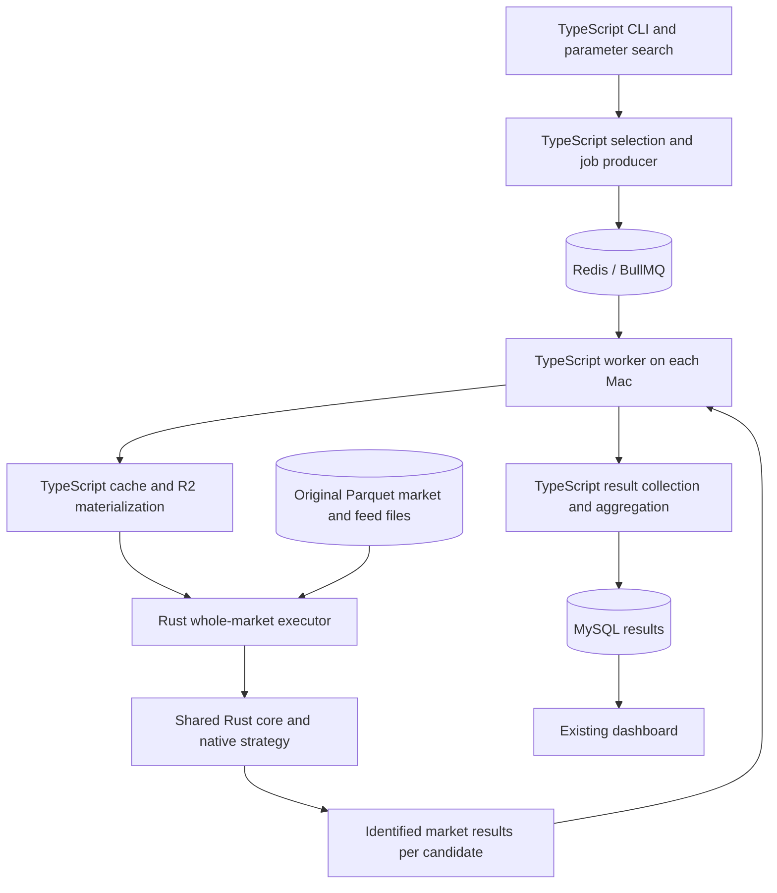
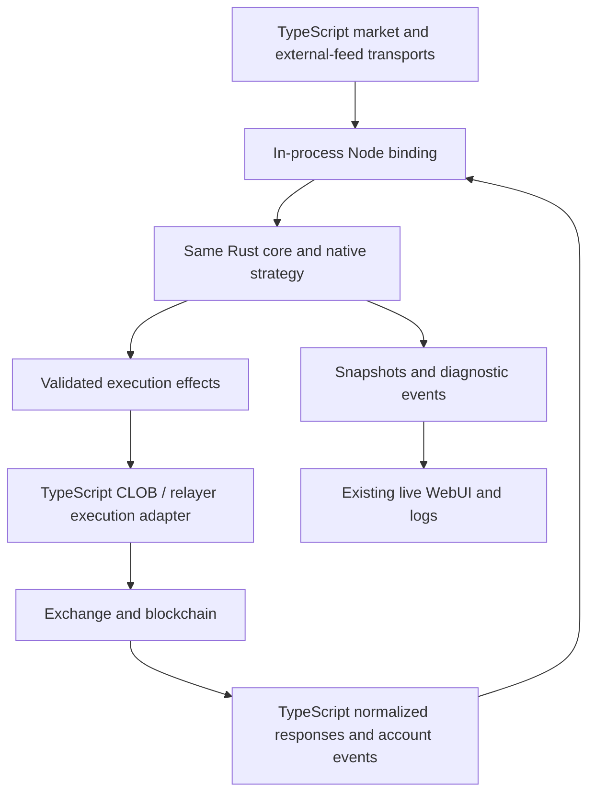

> **Superseded architecture proposal:** The active migration uses a standalone Rust runtime with full native live connections/signing/execution and authoritative aggregation. See [the agreed specification](../../docs/rust-migration/RUST-MIGRATION-SPEC.md). The earlier Node-binding/TypeScript live execution split below is retained as historical analysis only.

# Rust migration architecture and remaining work

The recommended target is a shared Rust trading and replay core surrounded by the existing TypeScript services. Keep Parquet on disk. Reuse the native implementation and differential checks, and turn them into the production implementation that subsequent benchmarks measure. Do not discard them and start a separate rewrite after benchmarking.

This analysis covers the repository's execution paths, strategy/plugin contracts, replay modes, queue/database/fleet lifecycle and UI boundaries. Three independent agents audited replay/core, live/strategy parity and fleet/control services; the primary review checked their conclusions against the code and existing measurements. It is an architecture and implementation-scope audit, not a line-by-line certification of every historical research strategy. No migration, benchmark, deployment or live order was started.

The source baseline is production commit `07245602d6ff9bca0dcdf772134cba3dd227526c`, the isolated Rust branch through `87574149ed9c4b0b3c2f2bdd904086d1c9d521cb`, and the preserved shared replay prototype under `results/handoff-20261007/`.

## Recommended ownership

| Area                                                                                | Destination                                       | What changes                                                                                                                                       |
| ----------------------------------------------------------------------------------- | ------------------------------------------------- | -------------------------------------------------------------------------------------------------------------------------------------------------- |
| Market selection, resolution/strike metadata, eligibility and CLI                   | TypeScript                                        | Keep existing behavior; add explicit engine/strategy capability selection.                                                                         |
| Redis/BullMQ producers, locks, retries, heartbeats and worker supervisor            | TypeScript                                        | Keep scheduling; invoke and supervise a versioned Rust executor. Add grouped-candidate contracts separately.                                       |
| Fleet lifecycle, self-update and machine management                                 | Existing TypeScript, shell and Ansible            | Add native binary provisioning, hash/target checks, capability reporting and rollback.                                                             |
| R2 transport, download retries, local cache discovery and package integrity         | TypeScript initially                              | Materialize verified local paths before invoking Rust. Rust reads the actual Parquet files.                                                        |
| Market decoding, books, snapshots and meaningful tick construction                  | Rust for native strategies                        | One core implementation used by native live and native replay; input adapters preserve their own source semantics.                                 |
| Historical feed reads, preparation, visibility clocks and synthetic tick ordering   | Rust                                              | Reuse current loaders; make symbols, requests and timing explicit job inputs.                                                                      |
| Strategy logic and required per-tick plugin calculations                            | Rust for migrated strategies                      | One native strategy version serves both live and backtests. Migrate active strategies selectively.                                                 |
| Strategy runner, shared risk/order validation and account feedback                  | Rust                                              | Extract a generic session; preserve current ordering, pending commitments and callback-generated intents.                                          |
| Portfolio, fees, reservations, reconciliation and derived context                   | Rust                                              | Reuse ledger/math; extend episode and live account-event routing.                                                                                  |
| Simulated order execution and per-market statistics                                 | Rust                                              | Retain backtest simulation as a separate adapter and return the existing market result contract.                                                   |
| Shared parameter replay                                                             | Rust computation plus TypeScript group scheduling | Share immutable market/feed work; keep strategy/order/RNG/portfolio state private to each candidate.                                               |
| Real signed CLOB requests, user WS/REST transport and blockchain/relayer effects    | TypeScript initially                              | Reuse authenticated I/O; return normalized responses/events to the Rust session. Native state is not also independently applied by a TS portfolio. |
| Batch/calendar/tail aggregation, extensions and SQL mapping/transactions            | TypeScript initially                              | Preserve existing formulas, sorting and transactions. Native aggregation code stays useful for differential verification.                          |
| Dashboard, WebUI, Bull Board, research tools and recorder/data acquisition services | TypeScript/React                                  | Keep them. Add engine provenance and grouped progress where needed.                                                                                |

The production comparison already uses this basic backtest boundary. Its Rust batch median was 99.627 seconds, while the aggregate/MySQL/Redis-cleanup phase median was 0.790 seconds. Even eliminating that entire phase would remove only about 0.8% of this measured runtime. This is evidence for leaving it alone initially, not a prediction for 100,000 markets.

## How the pieces connect

### Backtesting

The worker submits one request for a whole market or compatible candidate group. Rust opens Parquet, runs the complete tick loop and returns results. TypeScript does not call back into strategy logic on every replay tick. The existing measured one-native-process-per-market boundary is a suitable first implementation; a persistent executor is a later measured option, not a prerequisite for the observed gain.

Each additional Mac Mini runs the same worker service and matching native release. Redis continues distributing available market/group jobs. Candidate groups should be bounded so one enormous group does not monopolize a worker; avoid introducing an unbounded Rust thread pool underneath the existing worker process budget.

### Live trading

The same Rust core crate builds into the replay executable and a small Node native binding. NAPI-RS supports stateful Rust-backed objects and methods, making it a plausible binding mechanism; it is a proposed integration, not an existing component or measured zero-cost interface. See the [official class documentation](https://napi.rs/docs/concepts/class).

Rust owns the strategy, book state, account state and risk checks on the native path. TypeScript owns network connections, signed requests, credentials and operator-facing services. A session step may request an external effect, suspend, and resume when the TypeScript adapter returns its result. The serial event funnel must preserve current behavior while HTTP requests are outstanding; later ticks must not advance simply because Rust returned an effect. Live marshalling and session ordering need separate verification. The 6.19x backtest measurement is not a live latency or exchange execution claim.

## Strategy authoring and identity

Existing strategy artifacts are executable `.mjs` bundles, including their helpers and allowed dependencies. The native executable currently contains a hand-ported frozen v15 strategy. Rust cannot automatically execute arbitrary TypeScript artifacts. This is the most important product/workflow choice in the migration.

Recommended first release:

- Existing TypeScript strategies retain the existing TypeScript live and backtest paths.
- Selected active strategies are implemented against a native Rust strategy interface and compiled into a versioned native release.
- A migrated strategy uses the same native source/core version for both live and replay. The old TS implementation is a temporary differential oracle, not an independently maintained live counterpart.
- CLI and publication management remain TypeScript. Native parameters need the same strict validation, coercion/default semantics and reproducible identity as current strategies. Preserve Zod-facing validation where required and derive/check its contract against the native schema; do not maintain unrelated validation definitions silently.
- A native manifest identifies strategy/version, source provenance, core/protocol version, compiled artifact hash, platform target and supported inputs/plugins. The replay executable and Node addon have different binary hashes; both bind to the same source/core/strategy identity, and each platform artifact is verified independently. A historical `.mjs` SHA can identify the port's reference source, but cannot substitute for a Rust binary hash.
- Engine selection is explicit and pinned to the strategy/runtime contract. A worker defers a missing capability only when a known compatible update can resolve it; permanently unsupported jobs fail clearly or use an explicitly selected legacy path. It never silently substitutes frozen v15 or a different engine.

New strategies intended for the native speed path should be written in Rust. Existing TS authoring can continue for legacy strategies. Retaining arbitrary TS callbacks inside every Rust replay tick or embedding a JS runtime would be a different architecture requiring its own benchmark. A language-neutral strategy description is another possible future project, not a feature the current code already provides. Do not make automatic translation of arbitrary TS a dependency of the first migration.

## Current code and remaining implementation

The experiment contains about 4,200 lines of native source across ten modules. Its value lies in implemented behavior and independent tests, not its size. The current foundation already includes ordered delta-Parquet replay, full books/snapshots, original Binance/Chainlink reads, the selected strategy, broad local order execution, ledger/reconciliation, context metrics and market/batch statistics.

Existing checks include fifteen Rust unit tests, 162 full-output engine behavior fixtures, five aggregation fixtures, 2,077 decimal-format cases, full replay parity evidence for the selected 1,000-market workload and three real-service end-to-end pairs. Core unit/differential checks were rerun successfully immediately before this broader audit. The shared replay prototype reports sixteen tests; ten candidates have full per-event checks, while ninety additional candidates have result/statistics checks.

Important remaining work:

| Work package                         | Existing foundation                                           | Missing work                                                                                                                                                          | Relative size                     |
| ------------------------------------ | ------------------------------------------------------------- | --------------------------------------------------------------------------------------------------------------------------------------------------------------------- | --------------------------------- |
| Extract reusable core                | Separate native source modules already exist                  | Move runtime out of monolithic entry point; define explicit session/config/event/effect interfaces; separate shared risk/account state from simulated execution       | Medium                            |
| General strategy runner              | Selected market/account behavior and tested local engine      | Market/account callbacks returning intent lists, bounded recursive feedback, required plugin capture/reset, live balance/warmup/late-start context                    | Large                             |
| Real native job bridge               | Current processor injection and measured whole-market handoff | Build requests from actual jobs; complete output validation, error/skip semantics, explicit seed, configurable feeds/limits, fresh scratch ownership and bounded logs | Medium                            |
| Native strategy release workflow     | Frozen source/artifact reference and binary hashes            | Parameter contracts, native artifact manifest/publication, hash/target/core compatibility, CLI selection and worker capabilities                                      | Medium to large                   |
| Live native integration              | Ledger/risk/strategy algorithms and current TS I/O adapters   | State/effect boundary, Node binding, serial suspension/resume, market rotation/reset, old-market late events, restart/reconciliation and matching feed semantics      | Large                             |
| Native worker operations             | Existing TS supervisor, locks/retries and fleet tooling       | Native install/update/rollback, timeout/cancellation, signal propagation, failed child/output cleanup, mixed-version workers and graceful drains                      | Medium                            |
| Shared parameter production workflow | Working one-market Rust dispatcher and candidate independence | Compatibility/group IDs, producer ownership, per-candidate envelopes, durable ingestion, duplicate-safe partial retries and finalization                              | Large                             |
| Additional input modes               | Historical Telonex delta                                      | Recorder V4 receipt-order/frame/bootstrap/gap/feed semantics, paired files and legacy recorded/exchange-time/time-driven adapters                                     | Large, staged                     |
| Additional strategies/plugins        | One native strategy and selected metrics/feed family          | Active-strategy inventory and ports of only required plugin calculations; each requires live/replay parity                                                            | Open-ended by selected scope      |
| Very large result collections        | Current sorted TS aggregation and transactional persistence   | Bounded staging/result retrieval, incremental/chunked processing, extension compatibility and large-batch memory tests                                                | Large, separate scaling milestone |

The frozen benchmark bridge is not a deployable general worker. It finds the job in a frozen manifest, asserts its input equals that manifest and sends frozen data to Rust. The native entry point pins one ID/SHA, two outcome tokens, resolved UP/DOWN and 15-minute windows. Feed snapshot symbols are BTC-specific. Fee/risk defaults match the tested TS defaults; generalizing them is interface work, not evidence that the benchmark omitted those calculations.

The generic runner is also incomplete. `Strategy.onAccountEvent` permits new intents; native measured `strategy.rs` only clears a pending flag and `main.rs` explicitly relies on no new account intents. The fixture runner can exercise artificial feedback, proving engine behavior rather than a complete production callback dispatcher.

Other correctness boundaries need explicit tests. Native currently rejects certain malformed rows that the TS delta decoder skips, and its sequence handling is bounded by exact f64 range while TS carries bigint source sequences. Checked input files did not expose these differences. Resolve valid-input preflight versus compatible skipping, preserve integer sequence identity, and test malformed/large-sequence inputs before widening support.

Recorder V4 is a distinct adapter, not a format flag on the current Rust decoder. It preserves receipt order and frame child order, restores bootstrap state without strategy ticks, handles gaps/control resets and recorded-feed state, and uses its own window rules. Its live and replay adapter semantics must remain shared. Support it before using a native strategy in a live configuration that depends on those captured-feed capabilities.

## Shared parameter replay across the fleet

The current producer creates a separate run for one parameter set, a parent aggregate job and one child per market. The existing grid generator emits separate CLI commands. It does not discover compatible candidates across unrelated submissions. Therefore shared replay requires a new sweep/group submission contract.

A compatible market group must agree on input identity, strategy/core version, ordering/window semantics and all shared feed requests/latency/settings. It shares reads, decoding, books/snapshots and feed observations only. Every candidate retains its own strategy state, context, RNG, orders, capital, portfolio and statistics.

The proposed result key is candidate submission identity plus market index, with candidate/parameter identity and content/provenance hashes. Candidate results are accepted durably once; duplicates with conflicting contents fail explicitly. Shared-input failure and individual-candidate failure need separate terminal/retry handling. Each candidate aggregates its expected terminal result set in original market order and produces its own ordinary run/market/segment records.

This needs duplicate-safe finalization: current fresh-run persistence throws when a submission already exists. A group parent cannot simply loop over candidates and retry everything after a crash between two commits. Existing extension locks/overlap rules should remain intact; grouped extensions are a separate acceptance milestone.

At 100,000 markets and 100 candidates, there are still ten million candidate-market results. Shared computation does not remove those rows. Current aggregation retrieves all child values at once, so bounded candidate chunks, staged results and memory-aware aggregation need assessment. Retaining TS here does not mean retaining an unlimited all-results-in-memory design.

The observed sharing gains of about 3.18x at ten candidates and 3.98x at 100 compare sequential native runs on one market. They are not gains against candidates already executing concurrently across four machines and cannot be multiplied by 6.194x as a measured production ratio.

## How far along the migration is

Percentages are planning estimates of implementation/integration/verification effort for specified targets, not measured test coverage, source-line ratios or speed estimates. They do not mean the benchmark omitted the remaining percentage of calculations.

| Target                                                                         | Planning estimate                      | Denominator                                                                                                                                                           |
| ------------------------------------------------------------------------------ | -------------------------------------- | --------------------------------------------------------------------------------------------------------------------------------------------------------------------- |
| Reusable computational foundation for tested v15/BTC 15-minute/delta workload  | 80–90%                                 | Algorithms and local replay/account/statistics behavior, with extraction and hardening remaining                                                                      |
| First proposed production native release                                       | 35–50%, approximately 40% for planning | Selected native strategy, reusable core, real jobs, same native live core, artifacts, worker/fleet operations, bounded grouped-candidate integration and verification |
| Broad native runtime across existing replay modes and strategy/plugin families | Approximately 20–35%                   | Adds unported input semantics, generic plugin/runtime behavior and selected strategy ports; scope expands with required strategies                                    |
| Whole application rewritten in Rust                                            | No useful single percentage            | Recorder/acquisition/research/catalog/database/operator/UI systems would enlarge the project substantially and mostly remain valuable existing code                   |

The first percentage describes a narrow subset that is already executable. The second is the useful estimate for the proposed project; it excludes full 100,000-market staging/aggregation redesign, grouped extensions and all-strategy/all-mode coverage. Those are separately scoped milestones. The largest remaining work is making that subset a shared, versioned production runtime and validating its integrations. Shared parameter computation is already promising, but the grouped fleet workflow itself is early because its ownership/persistence contracts are not implemented.

## Implementation sequence and acceptance gates

1. **Fix the first release scope and contracts.** Start with the tested strategy and historical delta workload. Define native strategy/core/config identity, supported capabilities, normalized events/effects and complete result envelope. Keep Parquet and current TS services. Select the initial live feed configuration explicitly; unsupported input/plugin combinations stay on matching legacy TS paths.
2. **Extract the reusable native core.** Preserve tested math/order/ledger behavior. Split simulated execution from shared state/risk/session logic, implement generic event feedback, and keep original TS/numeric fixtures as oracles. Accept after local differential checks, including malformed/schema/sequence cases, remain aligned.
3. **Make ordinary native jobs and matching live sessions work.** Replace manifest lookup with actual job mapping; reuse TS acquisition and real execution transports. Add Node binding, episode reset, late events and suspension/resume tests. Require strategy/core identity and matching tick semantics across live and replay before activation.
4. **Package the ordinary native worker for the fleet.** Add native provenance/capabilities, verified binaries, restart/drain/kill/retry tests and rollback. Measure the implementation intended for deployment through real producer/Redis/MySQL/logs. This validates the existing roughly sixfold benefit without shared groups.
5. **Integrate shared candidate groups.** Reuse the prototype dispatcher, define compatible groups and candidate IDs, durable result ingestion and idempotent finalization. Check full traces across more active candidates/markets, reversed order, partial failures/retries and actual batch/segment persistence.
6. **Measure real sweep throughput.** Compare TS, ordinary native and shared native on the same total market/candidate workload, worker budget, input/cache conditions and services. Use the user's actual search parameters. Repeat end-to-end runs and report medians, ranges, CPU/memory and result volume. Extend measurement to the four-device fleet and larger batches in bounded stages.
7. **Broaden selectively.** Add Recorder V4/other adapters and active strategy/plugin ports with their own gates. Revisit aggregation/result staging for 10k/100k scale based on measured bottlenecks. Whole-platform language replacement is not a prerequisite.

Relative package sizes are implementation judgments, not calendar commitments. The strategy-authoring choice, required live feed mode and actual search sizes materially affect duration. A precise days estimate before those choices would hide unresolved scope.

## Architecture alternatives

| Option                                                      | Advantages                                                                                               | Cost and limitation                                                                                                                              | Recommendation                                                            |
| ----------------------------------------------------------- | -------------------------------------------------------------------------------------------------------- | ------------------------------------------------------------------------------------------------------------------------------------------------ | ------------------------------------------------------------------------- |
| Shared native core and native strategies; TS services       | Matches measured market-boundary path; reuses fleet and I/O; one native logic implementation live/replay | Requires native strategy authoring/releases and live binding                                                                                     | Recommended                                                               |
| Rust market processing with arbitrary TS strategy callbacks | Retains current strategy authoring                                                                       | Every replay tick crosses a language boundary; async plugins/dependencies complicate ownership; 6.19x cannot be inherited                        | Separate experiment only if preserving TS authoring is a hard requirement |
| Essentially all backend services in Rust                    | One backend implementation language                                                                      | Rewrites working queues, persistence, I/O, recorder and research tooling; broad new correctness/deployment surface with little demonstrated gain | Defer; no current performance justification                               |

React/browser UI would still remain web technology even in an all-Rust backend option. Rust does not require changing storage to Arrow or replacing Redis/MySQL.

## Evidence and code references

- [Production timings and scope](REPORT-END-TO-END.md), [expanded core parity contract](PARITY-SCOPE.md), [shared replay findings and evidence](SHARED-PARAMETER-REPLAY-CONTINUATION.md).
- [Native artifact gate](/Users/mijat/.codex/worktrees/rust-backtest-benchmark/polymarket-bot/experiments/rust-backtest/src/main.rs:512), [benchmark job bridge](/Users/mijat/.codex/worktrees/rust-backtest-benchmark/polymarket-bot/experiments/rust-backtest/e2e-worker.mts:49), [native account callback assumption](/Users/mijat/.codex/worktrees/rust-backtest-benchmark/polymarket-bot/experiments/rust-backtest/src/main.rs:305).
- [Production processor injection seam](/Users/mijat/Sites/polymarket-bot/src/backtest/marketProcessor.ts:65), [job contracts](/Users/mijat/Sites/polymarket-bot/src/backtest/jobTypes.ts:18), [full strategy callback contract](/Users/mijat/Sites/polymarket-bot/src/strategy/Strategy.ts:520).
- [Live serial runner](/Users/mijat/Sites/polymarket-bot/src/trading/StrategyRunner.ts:195), [episode reset](/Users/mijat/Sites/polymarket-bot/src/trading/StrategyRunner.ts:265), [late account routing](/Users/mijat/Sites/polymarket-bot/src/trading/StrategyRunner.ts:597), [execution adapter](/Users/mijat/Sites/polymarket-bot/src/trading/OrderManager.ts:43).
- [Recorder V4 shared dispatcher](/Users/mijat/Sites/polymarket-bot/src/recorder-v4/replay/dispatcher.ts:46), [TS typed-delta decoding](/Users/mijat/Sites/polymarket-bot/src/parquet/replay/replayTelonexDeltaParquetForMarket.ts:93), [existing artifact workflow](/Users/mijat/Sites/polymarket-bot/docs/strategy/external-artifacts.md).
- [Aggregate child collection](/Users/mijat/Sites/polymarket-bot/src/backtest/aggregateProcessor.ts:83), [fresh-run persistence identity](/Users/mijat/Sites/polymarket-bot/src/db/backtests.ts:382), [extension transaction](/Users/mijat/Sites/polymarket-bot/src/db/backtests.ts:838), [worker update wrapper](/Users/mijat/Sites/polymarket-bot/scripts/run-worker.sh:90).

Production code and the user's existing edits remain unchanged. Only this analysis is saved on the isolated Rust branch.
