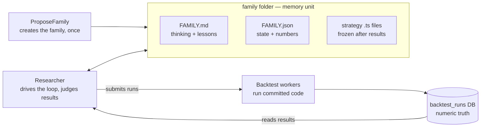

# Strategy Research Protocol

Strategy Research Protocol is the research layer on top of
[`strategy-research-protocol/ENGINE.md`](./ENGINE.md).
Its purpose is to let agents and humans propose, implement, backtest, judge,
and remember strategy families for Polymarket 15 minute Bitcoin up/down
markets — such that any fresh agent can continue from files alone.

This file is the map: the core invariants live here; every other rule lives
in exactly one home file, per the One Home Per Concept rule in
[`strategy-research-protocol/AGENTS.md`](./AGENTS.md).

## Repository Context

This folder lives inside the `polymarket-bot` repository. In this protocol,
`polymarket-bot/` is the current codebase that implements PolymarketTwinEngine:

```text
polymarket-bot/                 # PolymarketTwinEngine codebase
  docs/                         # engine and operational documentation
  src/                          # TypeScript source code
  dashboard/                    # backtest/dashboard UI
  strategy-research-protocol/   # this protocol
```

`strategy-research-protocol/` defines the research protocol only. The
executable engine, strategy runtime, backtest system, dashboard, and detailed
operational docs live in `polymarket-bot/`.

The protocol currently targets only Polymarket 15 minute Bitcoin up/down
binary markets — full assumptions in
[`strategy-research-protocol/SCOPE.md`](./SCOPE.md); terms
in [`strategy-research-protocol/GLOSSARY.md`](./GLOSSARY.md).

## Core invariants

1. **Live/backtest parity.** Live trading and backtests must run the same
   strategy logic on the same tick stream semantics. Any divergence is a bug,
   and this rule outranks experiment velocity.
2. **Files store knowledge; the database owns operational state.** What was
   tried and learned lives in family files. Whether a batch is still
   computing lives in the database and is queried on demand
   ([`strategy-research-protocol/tools/checkBatch.md`](./tools/checkBatch.md))
   — never mirrored into files.
3. **LLM judgment only at boundaries** (propose / judge / kill). Everything
   mechanical is a deterministic script.
4. **Pre-declared contracts.** Every experiment declares its `hypothesis` and
   `successCriteria` before running; both freeze once the experiment is
   `running`, and the verdict quotes the criteria verbatim. Deciding what
   counts as success after seeing results is how noise becomes "edge".

## Architecture

Two LLM roles around one memory unit (the family folder), with the backtest
infrastructure below:



- **ProposeFamily** creates one family, then stops —
  [`modules/ProposeFamily.md`](./modules/ProposeFamily.md).
- **The Researcher** drives one family per session: specs, runs, judges, and
  logs experiments, and decides continue-or-kill — the full lifecycle,
  judging rules, and bias containment live in
  [`modules/Researcher.md`](./modules/Researcher.md).
- **The user** alone flips a family to `live`.

Statuses, family files, every field's writer, and the update triggers are
defined in [`strategy-research-protocol/MEMORY.md`](./MEMORY.md); shapes are
enforced by `strategy-research-protocol/schemas/` and checked by
`npm run research:check`. The decision policy — stages, gates, stopping
rules — lives in
[`strategy-research-protocol/STAGE-GATES.md`](./STAGE-GATES.md).

## Repository layout

- [`strategy-research-protocol/AGENTS.md`](./AGENTS.md) — role map + the
  One Home Per Concept ownership table.
- [`strategy-research-protocol/SESSIONS.md`](./SESSIONS.md) — how sessions
  are launched and run: modes, isolation, locks, branch policy,
  preconditions, new-script checklist.
- [`strategy-research-protocol/STAGE-GATES.md`](./STAGE-GATES.md) — go/kill
  decision policy (versioned), including the measured-cost rules.
- [`strategy-research-protocol/MEMORY.md`](./MEMORY.md) — memory rules,
  field tables, statuses.
- [`strategy-research-protocol/LESSONS.md`](./LESSONS.md) — append-only
  cross-family lessons.
- [`strategy-research-protocol/CONSTRAINTS.md`](./CONSTRAINTS.md) — hard ban
  list for new families.
- [`strategy-research-protocol/SCOPE.md`](./SCOPE.md) —
  market, data, input, and cost assumptions.
- [`strategy-research-protocol/OPERATOR.md`](./OPERATOR.md) — the human
  operator's step-by-step cookbook.
- [`strategy-research-protocol/GLOSSARY.md`](./GLOSSARY.md) — term
  definitions.
- `strategy-research-protocol/modules/` — agent worker contracts (see the
  role map in [`AGENTS.md`](./AGENTS.md)).
- `strategy-research-protocol/rules/` — naming rules (family, experiment,
  batch UID).
- `strategy-research-protocol/tools/` — tool contracts
  ([`index`](./tools/index.md)).
- `strategy-research-protocol/schemas/` — Zod schemas for all artifacts.
- `strategy-research-protocol/scripts/` — executable helpers.
- `strategy-research-protocol/examples/` — reference examples (schema-validated by `research:check`).

Research artifacts live under `src/strategies/research/<family>/` — the
exact layout is defined in
[`strategy-research-protocol/MEMORY.md`](./MEMORY.md).

## Tools

- `runBacktest` — [`tools/runBacktest.md`](./tools/runBacktest.md)
- `extendBacktest` — [`tools/extendBacktest.md`](./tools/extendBacktest.md)
- `checkBatch` — [`tools/checkBatch.md`](./tools/checkBatch.md)
- `getBacktestResults` — [`tools/getBacktestResults.md`](./tools/getBacktestResults.md)
- `buildStrategyIndex` — [`tools/buildStrategyIndex.md`](./tools/buildStrategyIndex.md)
- `syncWorkerFleet` — [`tools/syncWorkerFleet.md`](./tools/syncWorkerFleet.md)

Scripts: `npm run research:check`, `npm run research:check-batch`,
`npm run research:build-index`.

Launch scripts (see
[`strategy-research-protocol/SESSIONS.md`](./SESSIONS.md)):

```bash
./strategy-research-protocol/scripts/propose-family.sh ["seed idea"]
./strategy-research-protocol/scripts/researcher.sh <family>            # autonomous
INTERACTIVE=1 ./strategy-research-protocol/scripts/researcher.sh <family>
```

Agents must preserve the invariants above and must not invent missing
protocol behavior. If a required rule is missing, add it to the protocol
explicitly before depending on it.
