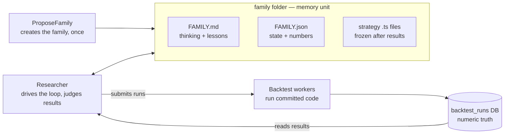
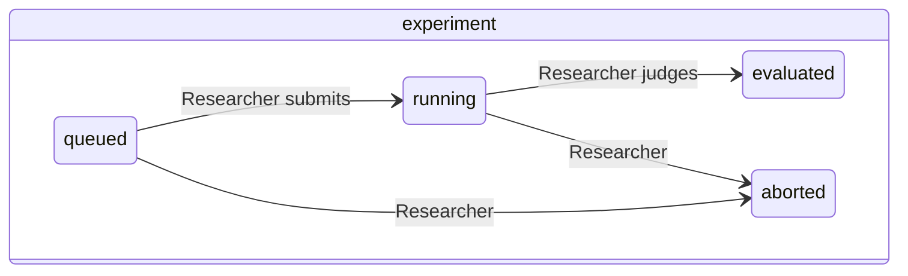
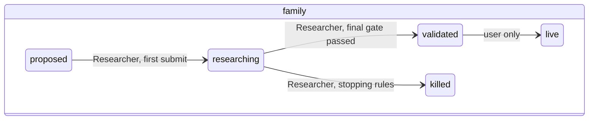

# Strategy Research Protocol

Strategy Research Protocol is the research layer on top of
[`strategy-research-protocol/PolymarketTwinEngine.md`](./PolymarketTwinEngine.md).
Its purpose is to let agents and humans propose, implement, backtest, judge,
and remember strategy families for Polymarket 15 minute Bitcoin up/down
markets — such that any fresh agent can continue from files alone.

## Repository Context

This folder lives inside the `polymarket-bot` repository. In this protocol,
`polymarket-bot/` is the current codebase that implements PolymarketTwinEngine:

```text
polymarket-bot/                 # PolymarketTwinEngine codebase
  docs/                         # engine and operational documentation
  src/                          # TypeScript source code
  dashboard/                    # backtest/dashboard UI
  strategy-research-protocol/   # this protocol
```

`strategy-research-protocol/` defines the research protocol only. The
executable engine, strategy runtime, backtest system, dashboard, and detailed
operational docs live in `polymarket-bot/`.

Common terms are defined in
[`strategy-research-protocol/GLOSSARY.md`](./GLOSSARY.md).

## Scope

This protocol currently targets only Polymarket 15 minute Bitcoin up/down
binary markets. The full research assumptions are defined in
[`strategy-research-protocol/RESEARCH_SCOPE.md`](./RESEARCH_SCOPE.md).

## Core invariants

1. **Live/backtest parity.** Live trading and backtests must run the same
   strategy logic on the same tick stream semantics. Any divergence is a bug,
   and this rule outranks experiment velocity.
2. **Files store knowledge; the database owns operational state.** What was
   tried and learned lives in family files. Whether a batch is still
   computing lives in the database and is queried on demand
   ([`strategy-research-protocol/tools/checkBatch.md`](./tools/checkBatch.md))
   — never mirrored into files.
3. **LLM judgment only at boundaries** (propose / judge / kill). Everything
   mechanical is a deterministic script.
4. **Pre-declared contracts.** Every experiment declares its `hypothesis` and
   `successCriteria` before running; both freeze once the experiment is
   `running`, and the verdict quotes the criteria verbatim. Deciding what
   counts as success after seeing results is how noise becomes "edge".

## Architecture

Two LLM roles around one memory unit (the family folder), with the backtest
infrastructure below:



- **ProposeFamily** creates one family: proposal sections in FAMILY.md,
  FAMILY.json with one queued `000-baseline`, and `000-baseline.ts`.
- **The Researcher** works one family per session in stateless iterations:
  read both files → the state implies the next action → do it → write files
  → exit. It specs and codes experiments, submits runs and stage extensions,
  reads and judges finished results (passes, gates, verdicts, champion,
  `validated`), writes every Research-log entry and `Lesson:`, and decides
  continue-or-kill per
  [`strategy-research-protocol/STAGE-GATES.md`](./STAGE-GATES.md). Judgment
  is bias-contained mechanically — frozen pre-declared criteria, measured
  numbers quoted in every decision, append-only records (see the Bias
  containment section of
  [`strategy-research-protocol/modules/Researcher.md`](./modules/Researcher.md)).
- **The user** alone flips a family to `live`.

## Statuses





- The verdict (`success` / `fail` / `inconclusive`) is not a status — it
  lives inside `outcome` once an experiment is `evaluated`.
- There is deliberately no "backtested" status: run completion is operational
  state, queried via `checkBatch`.
- `validated` is not terminal for research — challengers keep coming; the
  champion pointer moves only if a challenger passes the gates itself.
- `killed` requires a concrete `retryOnlyIf`.
- At most one experiment per family is `queued`/`running` at any time;
  parallelism comes from many families.

## Research artifacts

```text
src/strategies/research/<family>/FAMILY.md      reasoning + Research log
src/strategies/research/<family>/FAMILY.json    state + numbers
src/strategies/research/<family>/000-baseline.ts
src/strategies/research/<family>/<experiment-id>.ts
src/strategies/research/INDEX.json              generated rollup — never hand-edit
```

What belongs in each file, every field's writer, and the update triggers are
defined in [`strategy-research-protocol/MEMORY.md`](./MEMORY.md). Shapes are
enforced by `strategy-research-protocol/schemas/` and checked by
`npm run research:check`.

## The research loop

One experiment, end to end:

1. Researcher session starts: reads both family files; the statuses imply
   exactly one next action.
2. Spec: experiment record with `hypothesis` + `successCriteria` (+ new `.ts`
   for variations), status `queued`. Commit, push to `main`, and sync remote
   workers before submission — workers run committed code.
3. Smoke test (`--sequential --limit 10`, batchUid `--smoke` — never
   evidence), then submit coordinate-search pass 1 with `--baselineId`;
   record batchUid + submissionUids; status `running`.
4. Any later session runs `checkBatch`; when complete, the Researcher reads
   the results, judges the pass (`best` + `note`), and submits the next pass
   with winners fixed.
5. After the last pass the Researcher writes the full `outcome` (verdict
   quoting the successCriteria, metrics, `stageReached`), possibly after
   running a refinement grid or a stage extension (`extendBacktest`) per
   [`strategy-research-protocol/STAGE-GATES.md`](./STAGE-GATES.md).
6. Then it consumes the verdict: writes the Research-log entry with its
   `Lesson:` (log-before-acting), then queues the next experiment, or climbs
   to the next stage, or kills the family with `retryOnlyIf`.
7. `npm run research:build-index` when family metadata changed;
   `npm run research:check` must pass.

## Stage gates

The decision policy — when a strategy advances to more data (1000 → 3000 →
9000 markets), when a family keeps experimenting, and when it may be killed
(structural vs empirical kill, `minExperiments`) — lives in
[`strategy-research-protocol/STAGE-GATES.md`](./STAGE-GATES.md). The
Researcher cites it; it never invents criteria.

## Repository layout

- [`strategy-research-protocol/STAGE-GATES.md`](./STAGE-GATES.md) — go/kill
  decision policy (versioned), including the measured-cost rules.
- [`strategy-research-protocol/LESSONS.md`](./LESSONS.md) — append-only
  cross-family lessons; required reading for ProposeFamily and the
  Researcher.
- [`strategy-research-protocol/OPERATOR.md`](./OPERATOR.md) — the human
  operator's step-by-step cookbook.
- [`strategy-research-protocol/RUNNING.md`](./RUNNING.md) — how sessions are
  launched and handed off (scripts, cadence, branch policy).
- [`strategy-research-protocol/MEMORY.md`](./MEMORY.md) — memory rules and
  field tables.
- [`strategy-research-protocol/CONSTRAINTS.md`](./CONSTRAINTS.md) — hard ban
  list for new families.
- [`strategy-research-protocol/RESEARCH_SCOPE.md`](./RESEARCH_SCOPE.md) —
  market, data, input, and cost assumptions.
- [`strategy-research-protocol/GLOSSARY.md`](./GLOSSARY.md) — term
  definitions.
- `strategy-research-protocol/modules/` — agent worker contracts
  ([`index`](./modules/index.md)).
- `strategy-research-protocol/schemas/` — Zod schemas for all artifacts.
- `strategy-research-protocol/rules/` — naming rules (family, experiment,
  batch UID).
- `strategy-research-protocol/tools/` — tool contracts
  ([`index`](./tools/index.md)).
- `strategy-research-protocol/scripts/` — executable helpers.
- `strategy-research-protocol/examples/` — reference examples.

## Tools

- `runBacktest` — [`tools/runBacktest.md`](./tools/runBacktest.md)
- `extendBacktest` — [`tools/extendBacktest.md`](./tools/extendBacktest.md)
- `checkBatch` — [`tools/checkBatch.md`](./tools/checkBatch.md)
- `getBacktestResults` — [`tools/getBacktestResults.md`](./tools/getBacktestResults.md)
- `buildStrategyIndex` — [`tools/buildStrategyIndex.md`](./tools/buildStrategyIndex.md)
- `syncWorkerFleet` — [`tools/syncWorkerFleet.md`](./tools/syncWorkerFleet.md)

Scripts: `npm run research:check`, `npm run research:check-batch`,
`npm run research:build-index`.

## Modules

- [`strategy-research-protocol/modules/ProposeFamily.md`](./modules/ProposeFamily.md)
  — propose exactly one new family.
- [`strategy-research-protocol/modules/Researcher.md`](./modules/Researcher.md)
  — one research iteration for one family, including judging finished
  results.

Launch scripts (see [`strategy-research-protocol/RUNNING.md`](./RUNNING.md)):

```bash
./strategy-research-protocol/scripts/propose-family.sh ["seed idea"]
./strategy-research-protocol/scripts/researcher.sh <family>
```

Agents must preserve the invariants above and must not invent missing
protocol behavior. If a required rule is missing, add it to the protocol
explicitly before depending on it.
